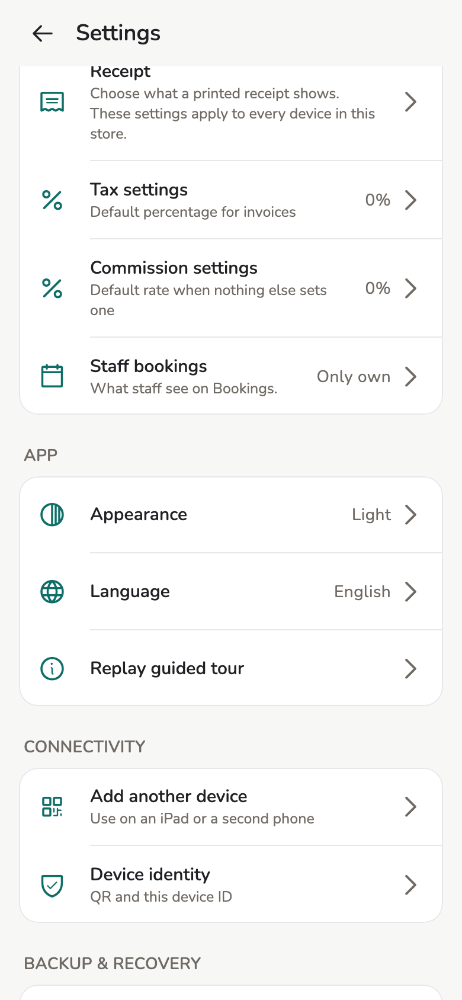

# Backup and recovery

Two different things: **identity** (who you are) and **data** (what happened).
Do both.

## Overview

The app keeps the salon **on the device**. Lose the device without a backup
and that device’s data is gone. **Staff** devices do not have these rows.

<figure class="shot-phone" markdown>
{ loading=lazy }
<figcaption>Settings → Backup & recovery</figcaption>
</figure>

## Concepts

| | **Identity** | **Data** |
| --- | --- | --- |
| What | Keypair that signs invoices and changes. On the device only. | Customers, appointments, invoices, staff, services |
| Protected by | 24-word phrase · Encrypted identity file · QR transfer | Data backup · Sync from another device |

Restoring identity does **not** bring customers back by itself.

## Usage

### Recovery phrase

1. **Settings → Identity backup & transfer → Recovery phrase**.
2. **Show phrase**, authenticate on the device.
3. Write the **24 words in order** on paper. **I wrote them down**.

!!! danger "Do not screenshot"

    Do not message it, do not save it to the camera roll. Copy only from your
    device. This screen is **not on macOS/Windows**.

### Encrypted identity file

1. **Settings → Identity backup & transfer → Encrypted backup file**.
2. Set a strong password, **Export identity backup**, pick a place.
3. The app **keeps no copy**. Lose the password and the file is dead.

### Salon data backup

1. **Settings → Data backup & restore**.
2. Backup password, **Export backup**.
3. Repeat on a schedule — last week’s file does not have this week’s bills.

### New device

Welcome → **Restore an existing identity**: 24 words, or file + password, or
**Receive on this device**. Then **Import backup** for data, or
[sync](devices.md).

### Move to a new device

When the old device still works, same Wi-Fi. New device shows a QR; old
device **Transfer identity**. The old device **keeps a copy**. Do **not** use
this to add a parallel device.

## Troubleshooting

| Situation | Do |
| --- | --- |
| New phone, old one still here | Transfer identity, or phrase / file |
| Lost phone | New device: phrase or file. Data: data file or another synced device |
| Several devices at once | **Add another device** / invite — do not transfer identity |

## Related pages

- [Devices and sync](devices.md)
- [Desktop](desktop.md)
- [Identity](../tech/identity.md)
