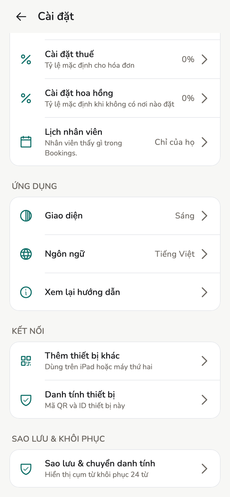

# Sao lưu và khôi phục

Hai việc khác nhau: **danh tính** (máy này là ai) và **dữ liệu** (khách, lịch,
hóa đơn). Cần làm cả hai.

## Tổng quan

Tiệm nằm **trên máy**. Mất máy mà chưa sao lưu thì mất dữ liệu trên máy đó.
Máy **Nhân viên** không có các mục sao lưu này.

<figure class="shot-phone" markdown>
{ loading=lazy }
<figcaption>Cài đặt → Sao lưu & khôi phục</figcaption>
</figure>

## Khái niệm

| | **Danh tính** | **Dữ liệu** |
| --- | --- | --- |
| Là gì | Keypair ký hóa đơn và thay đổi. Chỉ trên máy. | Khách, lịch hẹn, hóa đơn, nhân viên, dịch vụ |
| Bảo vệ bằng | Cụm từ 24 từ · Tệp danh tính đã mã hoá · Chuyển QR | Sao lưu dữ liệu · Đồng bộ từ máy khác |

Khôi phục danh tính **không** tự mang khách về.

## Cách làm

### Cụm từ khôi phục

1. **Cài đặt → Sao lưu & chuyển danh tính → Cụm từ khôi phục**.
2. **Hiển thị cụm từ**, xác thực máy.
3. Ghi **24 từ đúng thứ tự** ra giấy. **Tôi đã ghi lại**.

!!! danger "Không chụp màn hình"

    Không nhắn tin, không lưu vào cuộn ảnh. Chỉ chép từ trên máy bạn. Màn này
    **không có trên macOS/Windows**.

### Tệp sao lưu danh tính

1. **Cài đặt → Sao lưu & chuyển danh tính → Tệp sao lưu đã mã hoá**.
2. Đặt mật khẩu mạnh, **Xuất sao lưu danh tính**, chọn nơi cất.
3. App **không giữ bản sao**. Quên mật khẩu thì tệp đó coi như bỏ.

### Sao lưu dữ liệu tiệm

1. **Cài đặt → Sao lưu & khôi phục dữ liệu**.
2. Mật khẩu sao lưu, **Xuất sao lưu**.
3. Lặp định kỳ: file cũ không có hóa đơn tuần này.

### Máy mới

Màn chào → **Khôi phục danh tính hiện có**: 24 từ, hoặc tệp + mật khẩu, hoặc
**Nhận trên thiết bị này**. Sau đó **Nhập sao lưu** dữ liệu, hoặc
[đồng bộ](devices.md).

### Chuyển sang thiết bị mới

Khi máy cũ còn, cùng Wi-Fi. Máy mới hiện QR; máy cũ **Chuyển danh tính**. Máy
cũ **vẫn giữ bản sao**. **Không** dùng bước này để thêm máy chạy song song.

## Xử lý sự cố

| Tình huống | Làm |
| --- | --- |
| Đổi điện thoại, máy cũ còn | Chuyển danh tính, hoặc cụm từ / tệp |
| Mất điện thoại | Máy mới: cụm từ hoặc tệp. Dữ liệu: tệp dữ liệu hoặc máy khác đang sync |
| Nhiều máy cùng lúc | **Thêm thiết bị khác** / mời — không chuyển danh tính |

## Trang liên quan

- [Thiết bị và đồng bộ](devices.md)
- [Máy tính bàn](desktop.md)
- [Identity](../tech/identity.md)
