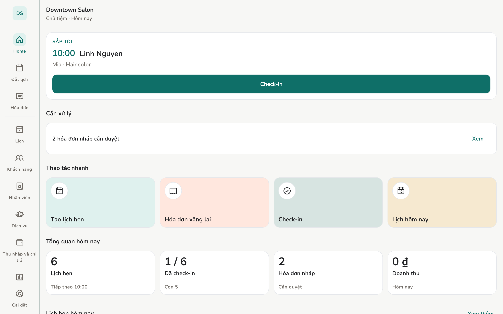

# Máy tính bàn

macOS và Windows làm được việc quầy. Menu dọc bên trái, cùng các màn với
điện thoại.

## Tổng quan

Máy tính có identity riêng và đồng bộ giống điện thoại.

<figure markdown>
{ loading=lazy }
<figcaption>Máy tính bàn (cùng layout máy tính bảng)</figcaption>
</figure>

## Cách làm

Desktop **hiện QR**; điện thoại chủ **quét**. Desktop không cần camera.
**Không có điện thoại của Chủ tiệm thì không kết nạp được PC**, trừ khi máy
tính là máy *duy nhất* và bạn tạo tiệm ngay trên đó.

Mời với vai trò **Quản lý**, chỉ nâng Chủ khi có lý do. Windows lưu khoá theo
user đăng nhập OS.

## Giới hạn

Hai màn cố ý không có:

1. **Hiển thị cụm từ khôi phục**: màn này hiện thẳng bí mật ra màn hình. Cụm
   từ chỉ xem trên **điện thoại**.
2. **Chuyển sang thiết bị mới** (bên gửi): cần camera. Muốn thay máy tính thì
   ghép nó như một thiết bị mới, đừng chuyển identity sang.

**Không** bị giấu: tệp sao lưu danh tính (gõ mật khẩu), sao lưu dữ liệu.

Nếu máy tính là máy duy nhất, hãy cất tệp sao lưu **ở ngoài** PC đó. Khôi
phục nghĩa là cài lại từ đầu rồi nạp tệp vào.

Không có widget màn hình chính. Biên lai in qua hộp thoại in của hệ điều hành.

## Trang liên quan

- [Thiết bị và đồng bộ](devices.md)
- [Sao lưu và khôi phục](backup.md)
- [Tải về](downloads.md)
