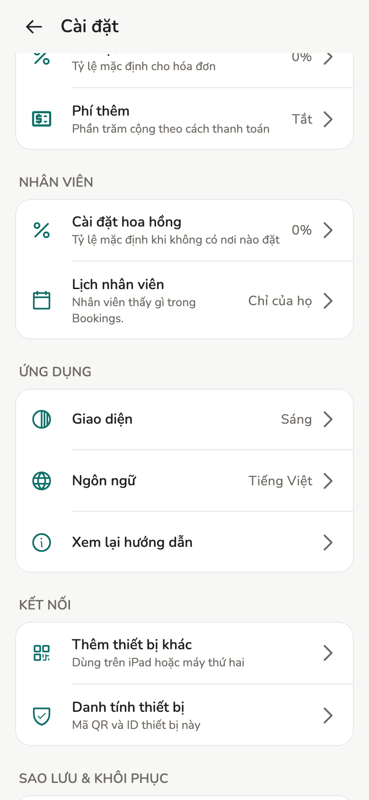

# Thiết bị và đồng bộ

Mỗi máy có identity riêng. Thêm máy **không** phải “đăng nhập cùng tài khoản”.

## Tổng quan

Đồng bộ là các **thiết bị đã tin cậy** gửi [event](../reference/terminology.md#event) cho
nhau, không đưa tiệm lên cloud rồi tải xuống.

<figure class="shot-phone" markdown>
{ loading=lazy }
<figcaption>Cài đặt → Thêm thiết bị khác / Danh tính thiết bị</figcaption>
</figure>

## Cách làm

### Thêm thiết bị khác

Trên máy đang là Chủ:

1. **Cài đặt → Thêm thiết bị khác**.
2. Máy kia: **Cài đặt → Danh tính thiết bị**, hiện QR.
3. **Quét thiết bị kia**, đặt tên, gửi lời mời. Mặc định **Quản lý**.

Không sao chép khoá. Nâng lên Chủ sau trong **Nhân viên** nếu cần.

### Thiết bị đã tin cậy

- **Ngoại tuyến** — máy kia chưa mở app, hoặc chưa liên lạc được
- **Đang kết nối · Gần đây** — hai máy cùng mạng nội bộ (LAN)

**Ngắt kết nối** chỉ dừng đồng bộ. Nó **không** xoá người đó khỏi danh sách
Nhân viên.

### Đồng bộ khi app mở

**Cài đặt → Đồng bộ**: tự đồng bộ khi app đang mở trên cùng Wi-Fi (hoặc QR
nếu mạng chặn multicast). Điện thoại đang khoá thì không nhận được gì, vì không có hộp thư nào trên
cloud để lấy về.

### Bản 1.1.0 không đồng bộ qua internet

Không có mục **Cài đặt → Đồng bộ qua internet**. Máy phải cùng Wi-Fi, hoặc
ghép bằng QR. Tính năng đó sẽ có lại khi [Relay](../reference/terminology.md#relay)
được host — xem [Sync](../tech/sync.md).

### Thông báo

**Cài đặt → Thông báo đồng bộ**: banner *loại* việc, không kèm số tiền. Chỉ hiện
khi **app đang mở**.

## Trang liên quan

- [Sync (kiến trúc)](../tech/sync.md)
- [Sao lưu và khôi phục](backup.md)
- [Máy tính bàn](desktop.md)
