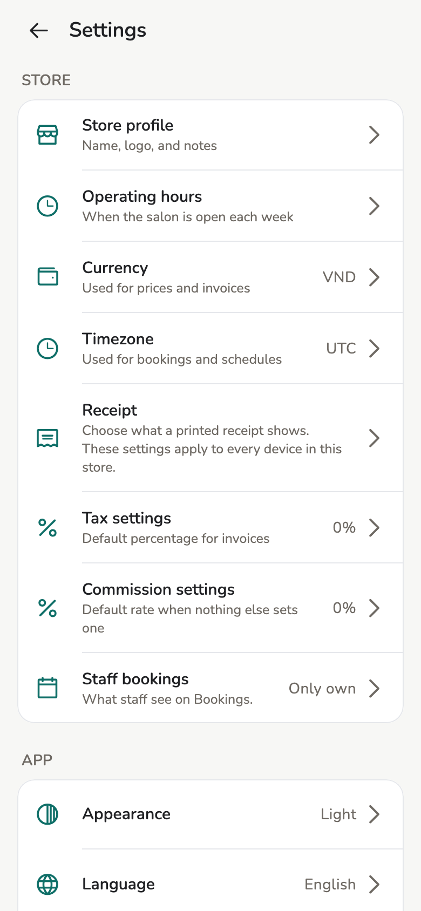

# Store settings

Store profile, hours, billing, commission, language, appearance, widget.

## Overview

**Settings** groups salon rows as **Store**, **Billing**, and **Staff**,
then **App** for this device. Some rows need Owner or Manager — the app
says **Requires owner or manager permission.**

<figure class="shot-phone" markdown>
{ loading=lazy }
<figcaption>Settings</figcaption>
</figure>

A **Staff** login on this device only sees: Appearance, Language, AI
assistant (if offered), Replay guided tour, Sync, Crash & usage reports.

## Configuration

**Store**

- **Store profile** — name, logo, notes. Save is per-section.
- **Operating hours** — when the salon is open each week.
- Currency: changing it only changes *display*, not numbers already frozen
  on old invoices.
- Time zone: changing it does **not** shift existing appointment times.

**Billing**

- **Receipt** — what a printed receipt shows, for every device of the store.
  [Printing](../guide/printing.md) covers it.
- **Tax settings** — default rate. Tax is on the subtotal *after* discount;
  tips are not taxed.
- **Extra fees** — percent added by payment method. Off until you enable a
  row. A Card fee is already in the list.

**Staff**

- **Commission settings** — default %. Order: service beats staff, staff
  beats store default.
- **Staff bookings** — whether a Staff login sees only their bookings.

**App** (this device)

- **Thermal printer** — which Bluetooth printer *this device* prints to.
  Unlike Receipt, it is not shared: each device has its own.
- **Language** and **Appearance** are on **this device** only.
- **AI assistant** — [its own page](../guide/ai-assistant.md).
- **Crash & usage reports** — anonymous, no salon data.

## Limitations

The home-screen widget is phone-only. A Staff device sees only *their*
bookings if the store sets **Staff bookings → Only own**.

## Related pages

- [AI assistant](../guide/ai-assistant.md)
- [Services and commission](../guide/services.md)
- [Printing](../guide/printing.md)
- [Desktop](desktop.md)
