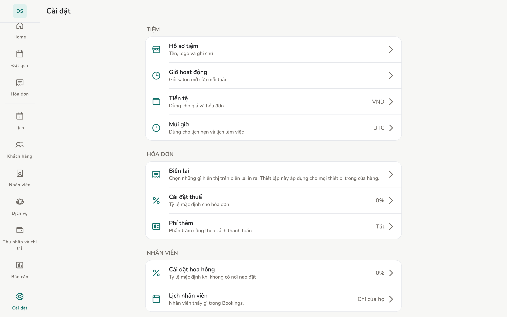

# Cài đặt tiệm

Hồ sơ tiệm, giờ mở cửa, thuế, ngôn ngữ, giao diện, widget.

## Tổng quan

**Cài đặt** có hai nhóm: **Tiệm** và **Ứng dụng**. Một số mục cần Chủ tiệm
hoặc Quản lý, app sẽ báo **Cần quyền chủ tiệm hoặc quản lý.**

<figure class="shot-phone" markdown>
{ loading=lazy }
<figcaption>Điện thoại</figcaption>
</figure>

<figure class="shot-wide" markdown>
{ loading=lazy }
<figcaption>Máy tính bảng và máy tính bàn</figcaption>
</figure>

Cài đặt của **Nhân viên** chỉ trên máy này: Giao diện, Ngôn ngữ, Trợ lý AI
(nếu có), Xem lại hướng dẫn, Đồng bộ, Báo cáo lỗi & sử dụng.

## Cấu hình

- **Hồ sơ tiệm** — tên, logo, ghi chú. Lưu từng phần.
- **Giờ hoạt động** — giờ salon mở cửa mỗi tuần.
- **Cài đặt thuế** — thuế suất mặc định. Thuế tính trên tạm tính *sau* giảm
  giá; tip không chịu thuế.
- **Cài đặt hoa hồng** — % mặc định. Thứ tự ưu tiên: % đặt trên dịch vụ được
  dùng trước, rồi tới % của nhân viên, cuối cùng mới là mặc định của tiệm.
- **Biên lai** — biên lai in ra hiện những gì, áp dụng mọi máy của tiệm. Xem
  [In biên lai](../guide/printing.md).
- **Máy in nhiệt** — máy này in ra máy in Bluetooth nào. Khác với Biên lai,
  mục này không dùng chung: mỗi thiết bị có máy in riêng.
- Tiền tệ: đổi chỉ đổi *cách hiện*, không đổi số đã chốt trên hóa đơn cũ.
- Múi giờ: đổi **không** dịch chuyển giờ lịch hẹn đã có.
- **Ngôn ngữ** và **Giao diện** chỉ trên **thiết bị này**.
- **Trợ lý AI** — [trang riêng](../guide/ai-assistant.md).
- **Báo cáo lỗi & sử dụng** — ẩn danh, không gồm dữ liệu tiệm.

## Giới hạn

Widget lịch chỉ điện thoại. Máy Nhân viên chỉ thấy lịch *của mình* nếu tiệm
đặt **Lịch nhân viên → Chỉ của họ**.

## Trang liên quan

- [Trợ lý AI](../guide/ai-assistant.md)
- [Dịch vụ và hoa hồng](../guide/services.md)
- [In biên lai](../guide/printing.md)
- [Máy tính bàn](desktop.md)
