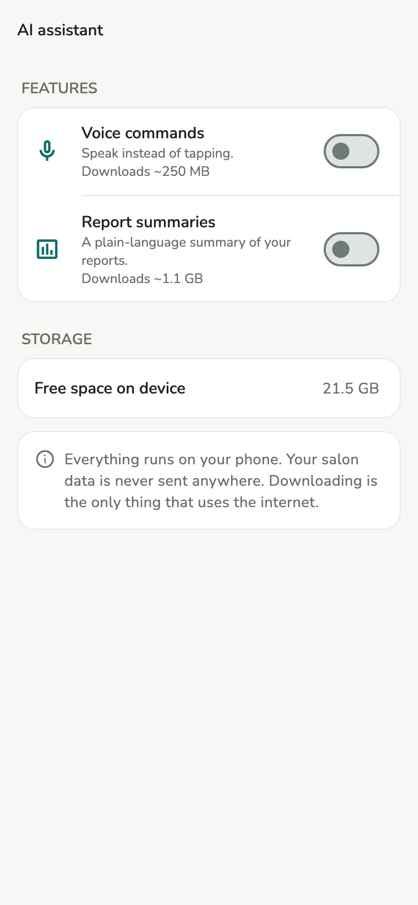
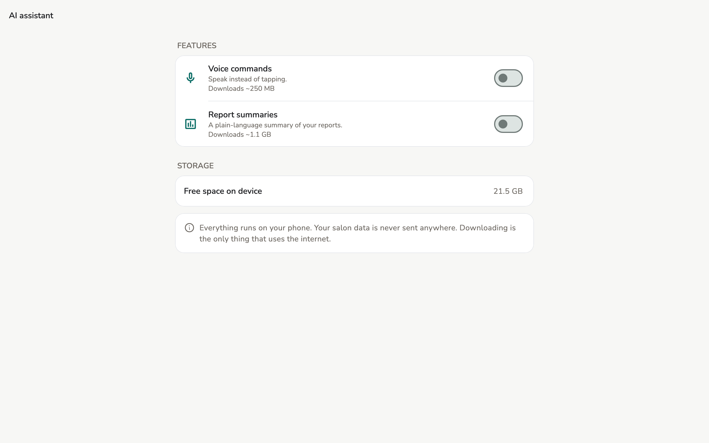
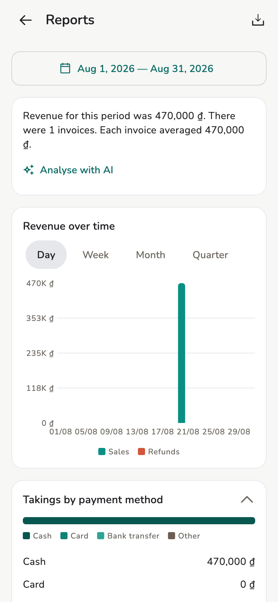
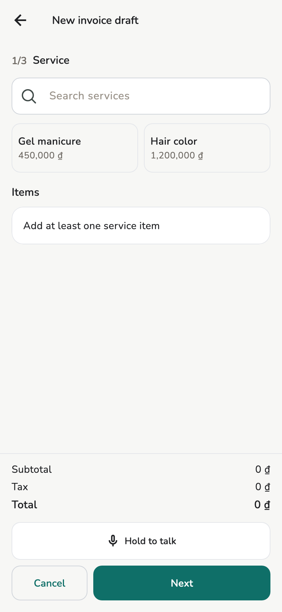

# AI assistant

Report summaries and voice commands — both **on the device**.

## Overview

**Settings → App → AI assistant**. Salon data is **never** sent to a cloud.
The internet is used only to **download a model**.

<figure class="shot-phone" markdown>
{ loading=lazy }
<figcaption>Phone</figcaption>
</figure>

<figure class="shot-wide" markdown>
{ loading=lazy }
<figcaption>Tablet and desktop</figcaption>
</figure>

Staff also have **AI assistant** on their device. If memory is too low the
screen says **Not available on this phone** — bookings and bills still work.

## Usage

1. **Settings → AI assistant**.
2. Enable **Report summaries** or **Voice commands**.
3. First time: **Download the AI model?** — size is on the row. You can
   **Only download on Wi-Fi**.
4. You can leave the screen; the download continues.

Turn a feature off any time. **Delete** frees space; turning it back on
downloads again.

### Report summaries

On [Reports](reports.md): **Analyse with AI** / **Automatic summary**. Can
take about a minute.

<figure markdown>
{ loading=lazy }
<figcaption>The summary card leads the report</figcaption>
</figure>

### Voice commands

On the [invoice](invoices.md) form: **Hold to talk**. Needs the microphone.
Fills the open form — it does **not** approve. **Undo** if a fill is wrong.

<figure markdown>
{ loading=lazy }
<figcaption>The button sits above Cancel / Next</figcaption>
</figure>

## Limitations

Low memory / model not downloaded: bill and read reports by hand as before.

## Related pages

- [Reports](reports.md)
- [Invoices and receipts](invoices.md)
- [Store settings](../admin/store-settings.md)
