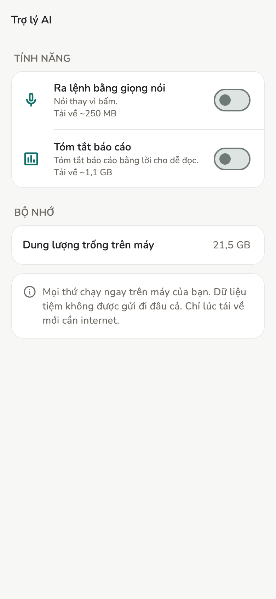
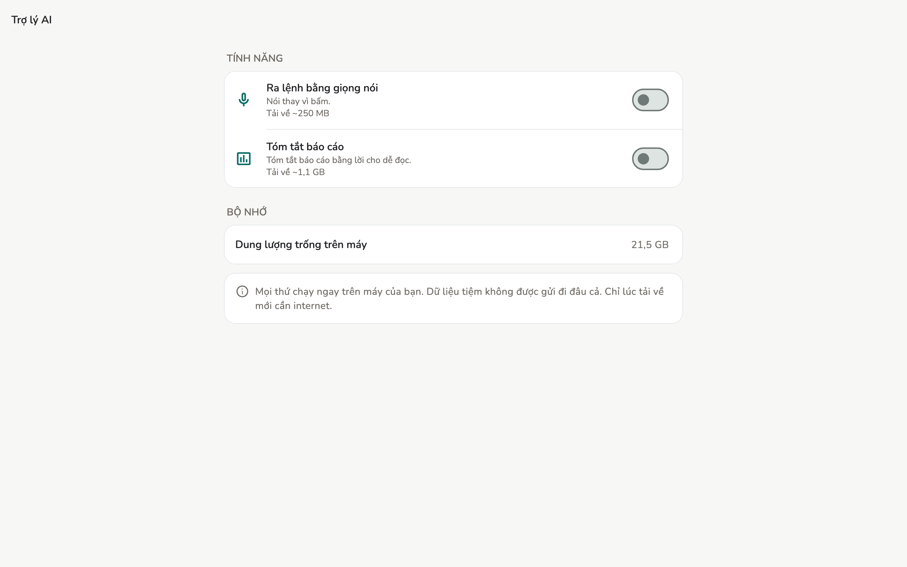
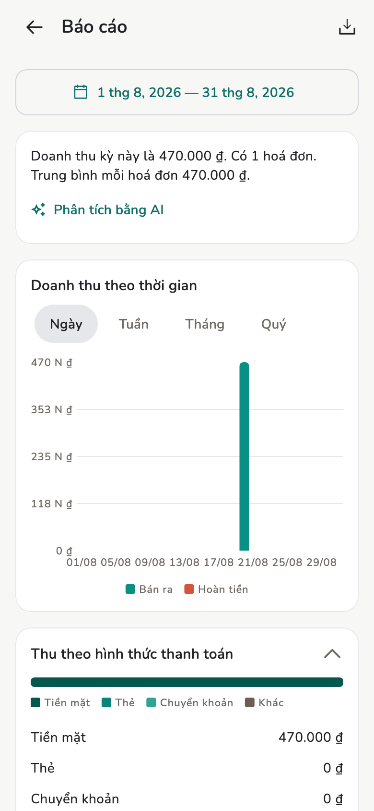
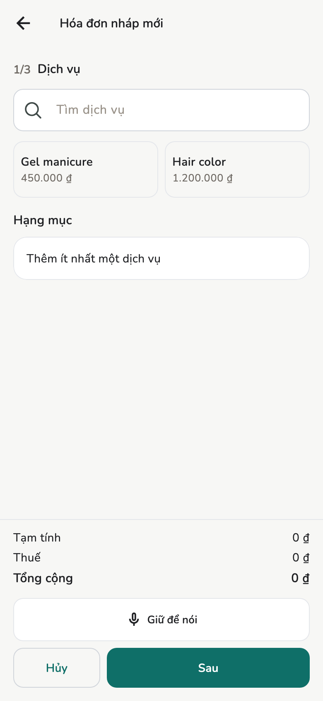

# Trợ lý AI

Tóm tắt báo cáo và điền form bằng giọng nói. Cả hai chạy **ngay trên máy**.

## Tổng quan

Mở **Cài đặt → Ứng dụng → Trợ lý AI**. Dữ liệu tiệm **không** gửi đi đâu.
Internet chỉ cần lúc **tải mô hình** về máy.

<figure class="shot-phone" markdown>
{ loading=lazy }
<figcaption>Điện thoại</figcaption>
</figure>

<figure class="shot-wide" markdown>
{ loading=lazy }
<figcaption>Máy tính bảng và máy tính bàn</figcaption>
</figure>

Nhân viên cũng có **Trợ lý AI** trên máy họ. Máy không đủ bộ nhớ thì app ghi
**Máy này không dùng được**, còn lịch và hóa đơn vẫn chạy.

## Cách làm

1. **Cài đặt → Trợ lý AI**.
2. Bật **Tóm tắt báo cáo** hoặc **Ra lệnh bằng giọng nói**.
3. Lần đầu: **Tải mô hình AI về máy?** — kích thước trên hàng. Có thể **Chỉ
   tải khi có Wi-Fi**.
4. Có thể rời màn hình; tải chạy nền.

Tắt bất cứ lúc nào. **Xoá** mô hình giải phóng dung lượng; bật lại phải tải
lần nữa.

### Tóm tắt báo cáo

Trên [Báo cáo](reports.md): **Phân tích bằng AI** / **Tóm tắt tự động**. Có
thể mất khoảng một phút.

<figure markdown>
{ loading=lazy }
<figcaption>Thẻ tóm tắt nằm ngay đầu màn Báo cáo</figcaption>
</figure>

### Ra lệnh bằng giọng nói

Trên form [hóa đơn](invoices.md): **Giữ để nói**. Cần quyền micro. Điền form
đang mở, **không** gửi duyệt. **Hoàn tác** nếu điền nhầm.

<figure markdown>
{ loading=lazy }
<figcaption>Nút nằm ngay trên hàng Hủy / Sau</figcaption>
</figure>

## Giới hạn

Máy yếu / chưa tải mô hình: lập hóa đơn và đọc báo cáo bằng tay như cũ.

## Trang liên quan

- [Báo cáo](reports.md)
- [Hóa đơn và biên lai](invoices.md)
- [Cài đặt tiệm](../admin/store-settings.md)
