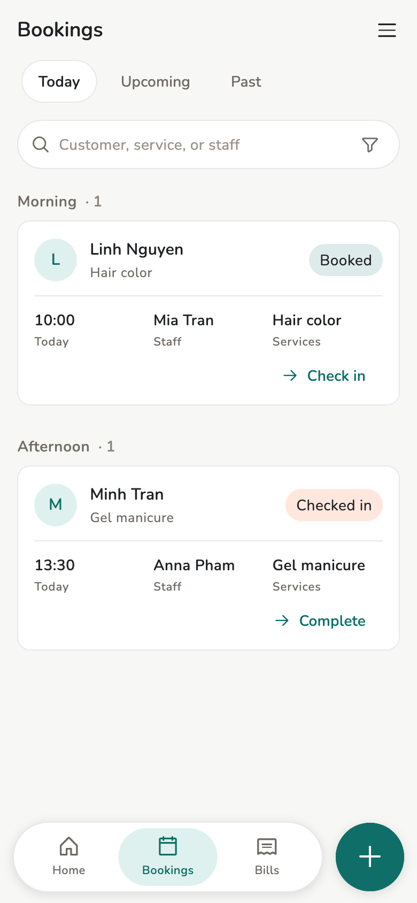
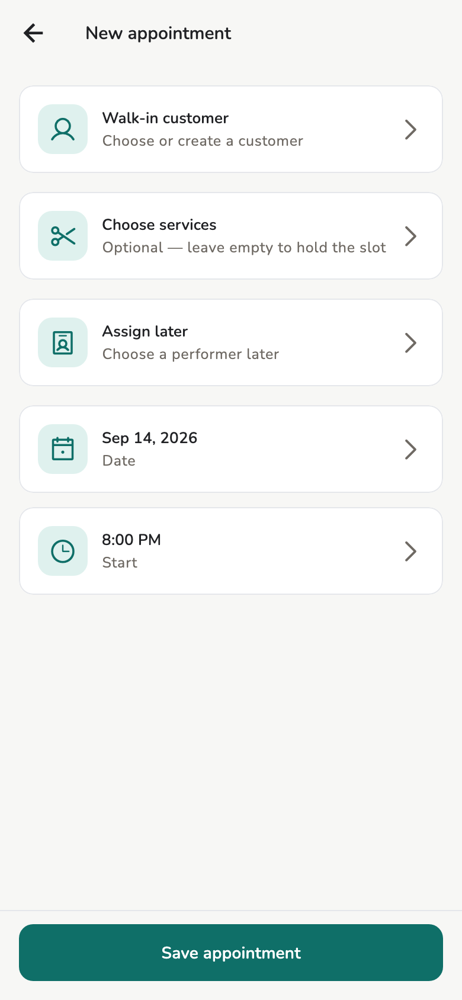
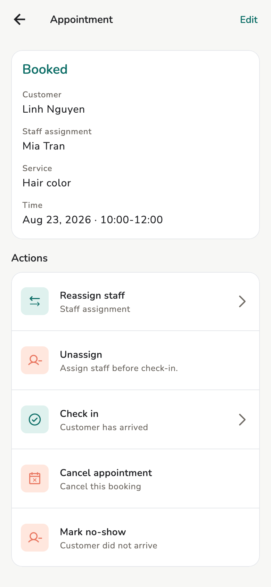

# Appointments

Book, check in, complete, cancel, mark no-show. Owner and Manager create
appointments.

## Overview

**Bookings** / **My Bookings**. **Staff cannot create appointments.**

<figure class="shot-phone" markdown>
{ loading=lazy }
<figcaption>Bookings</figcaption>
</figure>

## Prerequisites

Have [services](services.md) and [staff](staff.md) (a person or virtual
staff). The time must match [availability](schedule.md).

## Usage

=== "Owner / Manager"

    **Add → New appointment** (or **Dashboard → New appointment**):

    1. Customer (quick-create if needed)
    2. Services — more than one is allowed
    3. Staff — a real person or virtual staff; you can leave **unassigned**
       and assign later
    4. Time — the app checks availability

    If they are not free, the booking is refused; change the time or the
    person.

=== "Staff"

    **My Bookings**: appointments assigned to them, or the whole store if
    **Staff bookings** is **Whole store**. They do **not** get **New
    appointment**. They start **New invoice** from **Add**.

<figure markdown>
{ loading=lazy }
<figcaption>New appointment</figcaption>
</figure>

<figure markdown>
{ loading=lazy }
<figcaption>Appointment detail</figcaption>
</figure>

## Concepts

| Status | Meaning |
| --- | --- |
| Booked | Not yet arrived |
| Check in | Customer is here |
| Complete | Done — usually continue to an [invoice](invoices.md) |
| Cancelled | Will not happen |
| No-show | Did not arrive |

Unassigned bookings sit in needs-attention. Assign / reassign / unassign on
the detail screen — do not create a second booking.

Owner / Manager change status on appointment detail. Staff see bookings they
are allowed to see; they do not run the lifecycle the way a manager does.

## Related pages

- [Availability](schedule.md)
- [Customers](customers.md)
- [Invoices and receipts](invoices.md)
