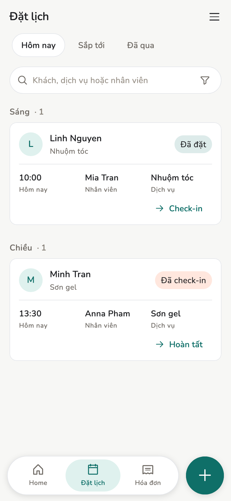
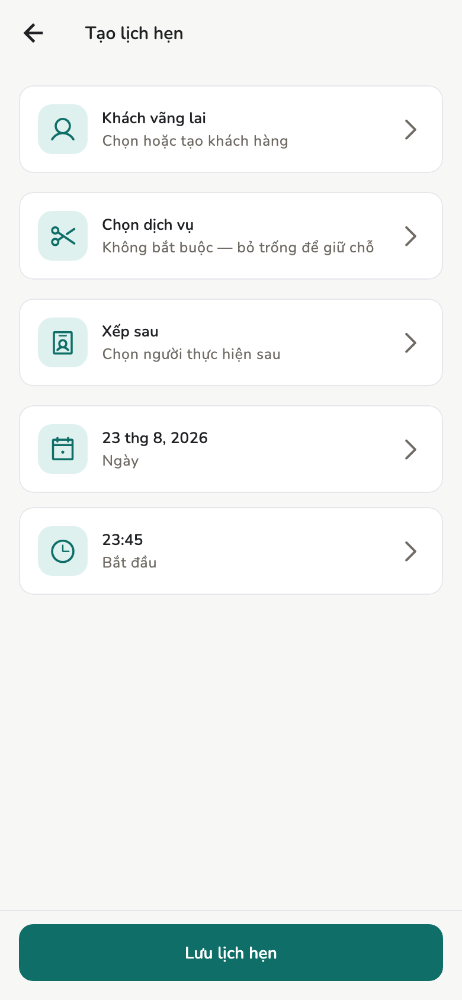
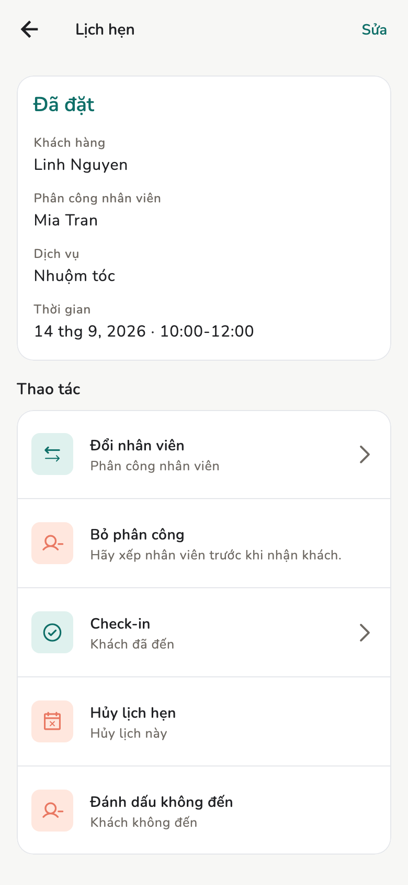

# Lịch hẹn

Đặt lịch, check-in, hoàn tất, hủy, hoặc đánh dấu khách không đến. Chỉ Chủ
tiệm và Quản lý tạo lịch mới.

## Tổng quan

Màn **Đặt lịch** (Chủ / Quản lý) hoặc **Lịch của tôi** (Nhân viên). Nhân viên
**không** có nút đặt lịch mới.

<figure class="shot-phone" markdown>
{ loading=lazy }
<figcaption>Đặt lịch</figcaption>
</figure>

## Điều kiện

Có [dịch vụ](services.md) và [nhân viên](staff.md) (người thật hoặc nhân viên
ảo). Giờ phải khớp [lịch làm việc](schedule.md).

## Cách làm

=== "Chủ tiệm / Quản lý"

    **Tạo mới → Đặt lịch mới** (hoặc **Tổng quan → Đặt lịch mới**):

    1. Khách (tạo nhanh nếu chưa có)
    2. Dịch vụ — có thể nhiều dịch vụ
    3. Nhân viên — người thật hoặc nhân viên ảo; có thể để **chưa gán** rồi
       gán sau
    4. Giờ — app kiểm tra rảnh

    Không rảnh thì không đặt được. Đổi giờ, hoặc đổi người.

=== "Nhân viên"

    Tab **Lịch của tôi**: lịch gán cho họ, hoặc cả tiệm nếu **Lịch nhân viên**
    là **Cả tiệm**. Họ **không** có **Đặt lịch mới**. Họ lập **Hóa đơn mới**
    từ **Tạo**.

<figure markdown>
{ loading=lazy }
<figcaption>Đặt lịch mới</figcaption>
</figure>

<figure markdown>
{ loading=lazy }
<figcaption>Chi tiết lịch hẹn</figcaption>
</figure>

## Khái niệm

| Trạng thái | Việc |
| --- | --- |
| Đã đặt | Chưa tới (**Hôm nay** / **Sắp tới** / **Đã qua**) |
| **Check-in** | Khách có mặt |
| **Hoàn tất** | Xong, thường chuyển sang [hóa đơn](invoices.md) |
| Hủy | Không làm |
| **Đánh dấu không đến** | Khách không tới |

Lịch chưa gán: **Cần xếp nhân viên**. **Xếp ngay** / **Xếp sau** trên chi tiết
— không tạo lịch mới.

Chủ tiệm và Quản lý đổi trạng thái ngay trong màn chi tiết. Nhân viên chỉ
xem được lịch trong phạm vi cho phép, không đổi trạng thái.

## Trang liên quan

- [Giờ rảnh](schedule.md)
- [Khách hàng](customers.md)
- [Hóa đơn và biên lai](invoices.md)
