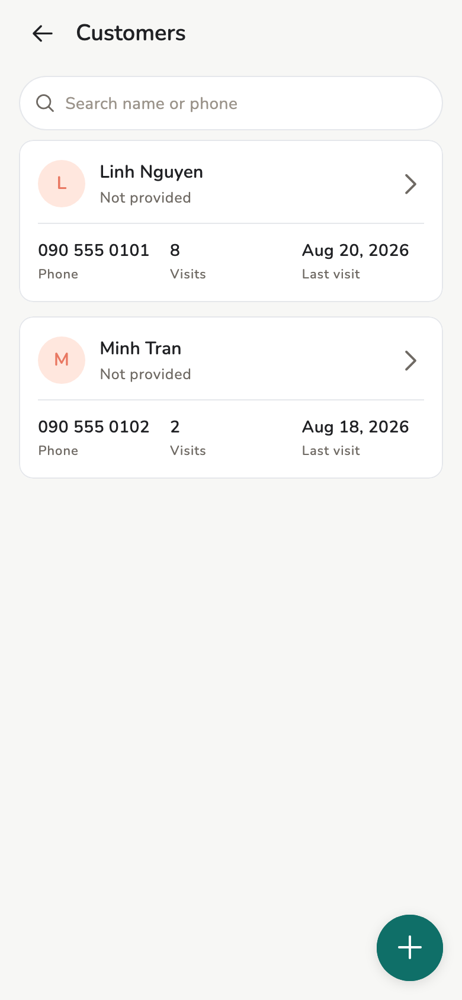
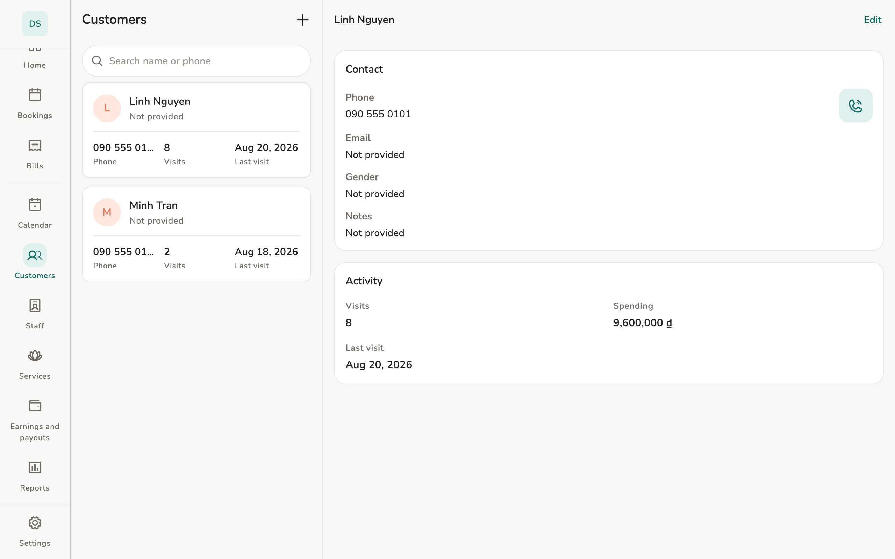
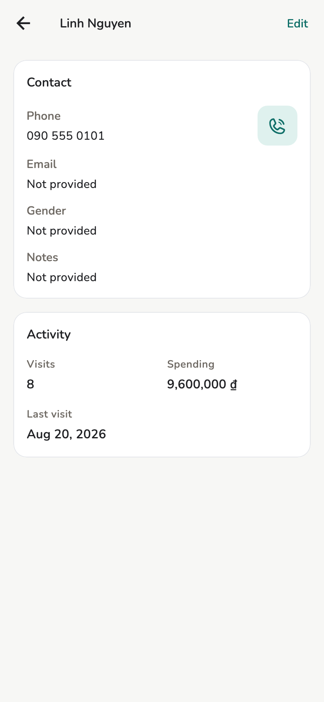

# Customers

This **store’s** contact list. There is no company-wide cloud profile.

## Overview

Name, phone, optional photo. Duplicate phone: the app warns — you decide (no
automatic merge).

<figure class="shot-phone" markdown>
{ loading=lazy }
<figcaption>Phone</figcaption>
</figure>

<figure class="shot-wide" markdown>
{ loading=lazy }
<figcaption>List and profile on tablet</figcaption>
</figure>

## Usage

=== "Owner / Manager"

    **More → Customers**, or from the booking / bill form.

=== "Staff"

    No Customers row under **More**. Create a customer from the **New
    invoice** form.

Customer detail: bookings, invoices, stats from store data on the device.

<figure markdown>
{ loading=lazy }
<figcaption>Customer detail</figcaption>
</figure>

An invoice with no customer can count as walk-in — **Customer mix** on
[Reports](reports.md) splits that group.

## Related pages

- [Appointments](appointments.md)
- [Invoices and receipts](invoices.md)
- [Reports](reports.md)
