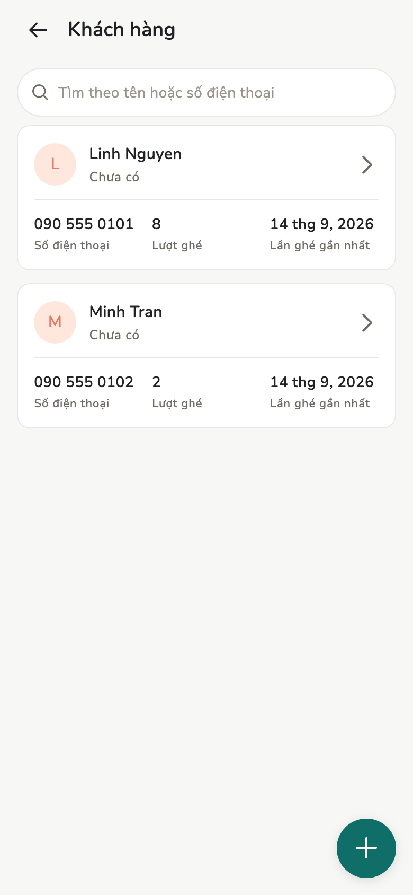
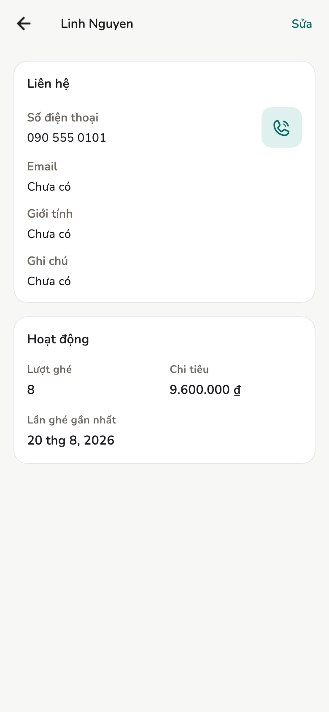

# Khách hàng

Danh bạ khách **của tiệm này**. Không có hồ sơ khách dùng chung trên cloud.

## Tổng quan

Tên, số điện thoại, ảnh nếu muốn. Trùng số thì app cảnh báo, bạn tự quyết
có dùng luôn hay tạo mới (không gộp tự động).

<figure class="shot-phone" markdown>
{ loading=lazy }
<figcaption>Khách hàng</figcaption>
</figure>

## Cách làm

=== "Chủ tiệm / Quản lý"

    **Thêm → Khách hàng**, hoặc ngay trên form đặt lịch / hóa đơn.

=== "Nhân viên"

    Không có ô Khách hàng trong **Thêm**. Tạo khách từ form **Hóa đơn mới**.

Chi tiết khách hiện lịch đã đặt, hóa đơn, và vài con số thống kê, lấy từ dữ
liệu tiệm trên máy.

<figure markdown>
{ loading=lazy }
<figcaption>Chi tiết khách</figcaption>
</figure>

Hóa đơn không gắn khách có thể là khách vãng lai. Báo cáo **Cơ cấu khách** tách
nhóm này.

## Trang liên quan

- [Lịch hẹn](appointments.md)
- [Hóa đơn và biên lai](invoices.md)
- [Báo cáo](reports.md)
