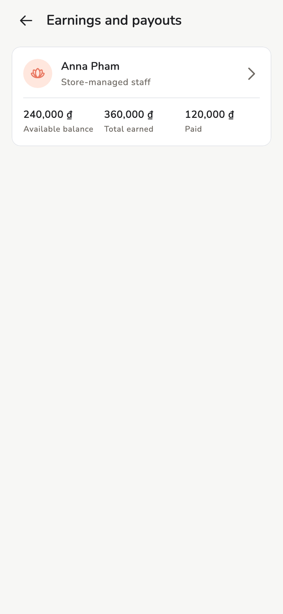

# Earnings and payouts

Commission from approved invoices, and marking a payout as received.

## Overview

**Earnings and payouts** (Owner / Manager) and **My earnings** (Staff).
Figures come from the snapshot at approve — not the *current* %.

<figure class="shot-phone" markdown>
{ loading=lazy }
<figcaption>Earnings</figcaption>
</figure>

## Usage

=== "Owner / Manager"

    Whole team, unpaid amounts, payout history. **Record payout**.

=== "Staff"

    Their share. **Acknowledge payout** on **My earnings**. They do not
    record payouts for someone else.

This does not move bank money — it only marks received. The same truth on
every synced device.

## Related pages

- [Services and commission](services.md)
- [Invoices and receipts](invoices.md)
- [Reports](reports.md)
