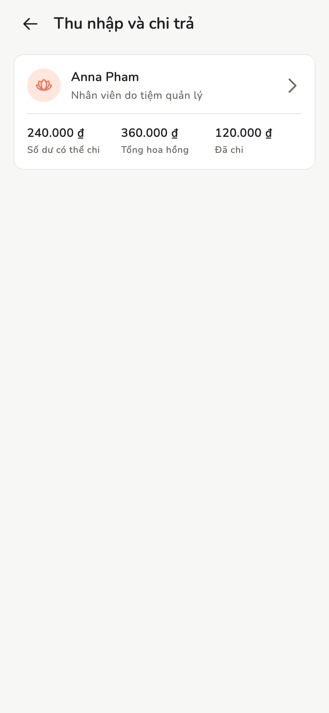

# Thu nhập và chi trả

Hoa hồng lấy từ hóa đơn đã duyệt, rồi đánh dấu đã trả.

## Tổng quan

Chủ / Quản lý xem **Thu nhập và chi trả** của cả đội. Nhân viên xem **Thu
nhập của tôi**. Số lấy từ lúc duyệt hóa đơn, không tính lại theo % hiện tại.

<figure class="shot-phone" markdown>
{ loading=lazy }
<figcaption>Thu nhập</figcaption>
</figure>

## Cách làm

=== "Chủ tiệm / Quản lý"

    Xem cả đội, số chưa trả, lịch sử chi trả. **Ghi nhận chi trả**.

=== "Nhân viên"

    Phần của họ. **Xác nhận đã nhận** trên **Thu nhập của tôi**. Không ghi
    chi trả cho người khác.

Thao tác này không chuyển khoản ngân hàng, chỉ đánh dấu đã nhận. Mọi máy đã đồng bộ đều thấy
giống nhau.

## Trang liên quan

- [Dịch vụ và hoa hồng](services.md)
- [Hóa đơn và biên lai](invoices.md)
- [Báo cáo](reports.md)
