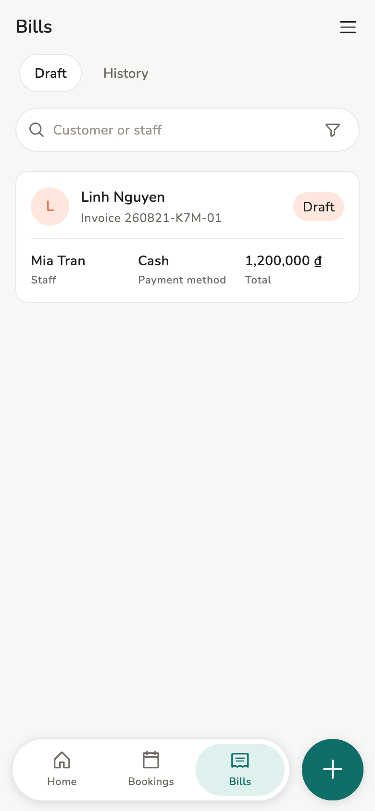
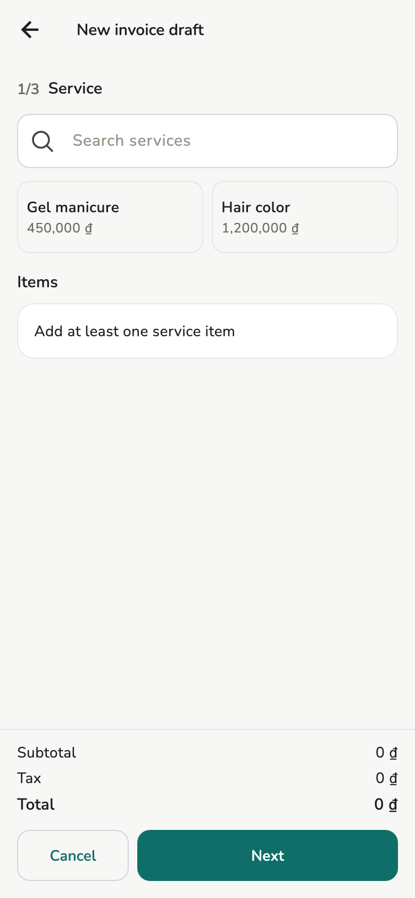
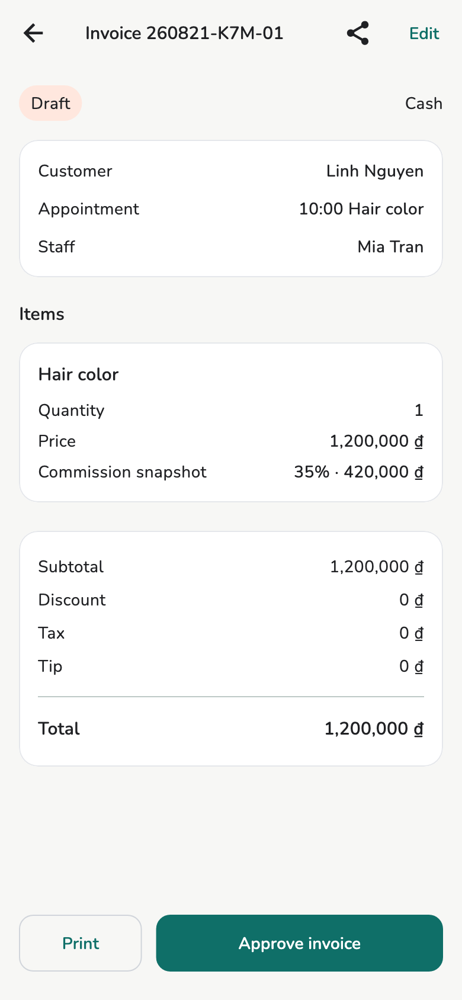

# Invoices and receipts

Draft, approve, print. Staff create drafts; Owner / Manager approve.

## Overview

**Bills** / **My Bills**. On approve, price, tax, extra fees, and commission
**freeze**.

<figure class="shot-phone" markdown>
{ loading=lazy }
<figcaption>Bills</figcaption>
</figure>

## Usage

**Add → New invoice** (or after completing an appointment):

- Optional customer (walk-in if empty)
- Staff and services
- Discount, tax (store default if enabled), tip, extra fees, payment method

An extra fee is a store add-on — not a service, not tax, not a bank charge.
Turn it on in **Settings → Billing → Extra fees** (the row after Tax). It is
off until you enable one. A Card fee applies when the bill is Card. On a
draft you can waive it for that bill. The receipt prints the stored name
and amount, then the total.

!!! tip "Voice on a phone"

    **Hold to talk** on the bill form. Needs **Settings → AI assistant →
    Voice commands** and the microphone. It fills the open form — **it does
    not approve**. Nothing is recorded or sent. Spoken service prices are
    ignored.

<figure markdown>
{ loading=lazy }
<figcaption>New invoice</figcaption>
</figure>

<figure markdown>
{ loading=lazy }
<figcaption>Invoice detail</figcaption>
</figure>

Owner / Manager: **Approve invoice**. Staff submit drafts; they do not
approve their own.

After approval, there is no overwrite:

- **Void invoice** — cancel the whole bill when no money was kept
- Refund — return part or a tip within the remaining limit

## Configuration

**Print** at the foot of an invoice, and what **Settings → Receipt** puts on
the paper, have their own page: [Printing](printing.md). That is also where
the **PROVISIONAL BILL** and **COPY** stamps are explained.

## Related pages

- [Printing](printing.md)
- [Store settings](../admin/store-settings.md)
- [Appointments](appointments.md)
- [AI assistant](ai-assistant.md)
- [Earnings](earnings.md)
