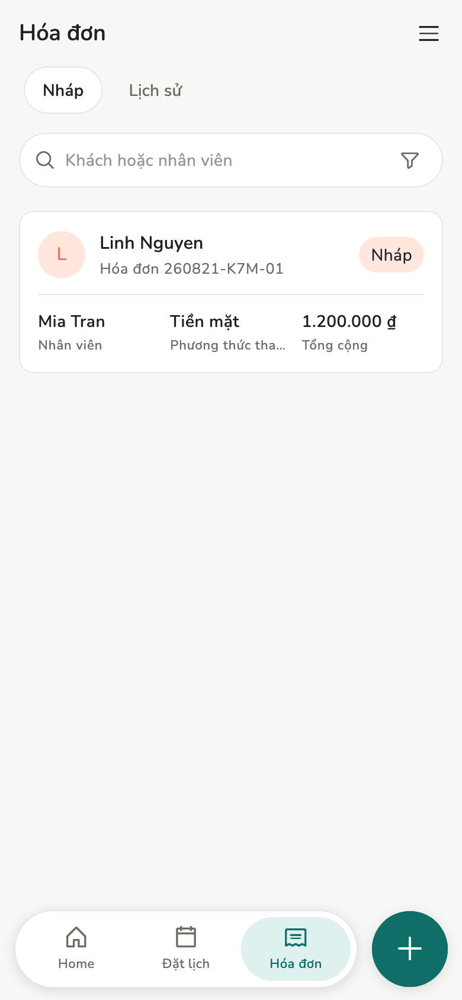
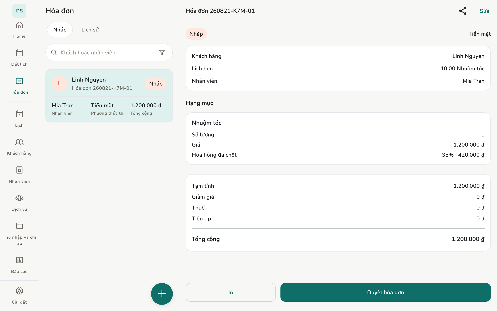
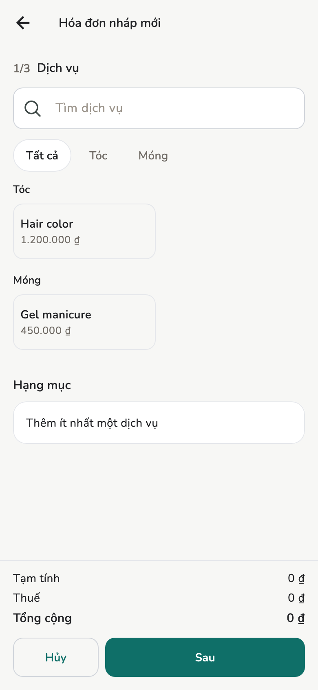
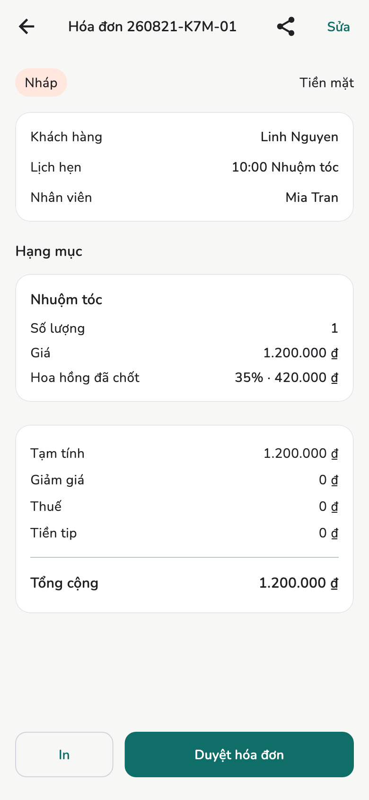

# Hóa đơn và biên lai

Lập nháp, duyệt, in biên lai. Nhân viên tạo nháp; Chủ / Quản lý duyệt.

## Tổng quan

Màn **Hóa đơn** (Chủ / Quản lý) hoặc **Hóa đơn của tôi** (Nhân viên). Khi
duyệt, giá, thuế, hoa hồng **khóa lại**, nên đổi giá sau không đụng hóa đơn cũ.

<figure class="shot-phone" markdown>
{ loading=lazy }
<figcaption>Điện thoại</figcaption>
</figure>

<figure class="shot-wide" markdown>
{ loading=lazy }
<figcaption>Danh sách và chi tiết trên máy tính bảng</figcaption>
</figure>

## Cách làm

**Tạo mới → Hóa đơn mới** (hoặc hoàn tất lịch hẹn):

- Khách tuỳ chọn (để trống nếu là khách vãng lai)
- Nhân viên và dịch vụ
- Giảm giá, thuế (mặc định tiệm nếu bật), tip, phương thức thanh toán

!!! tip "Giọng nói trên điện thoại"

    **Giữ để nói** trên form hóa đơn. Cần quyền micro và
    **Cài đặt → Trợ lý AI → Ra lệnh bằng giọng nói**. Điền form đang mở —
    **không gửi duyệt**. Không ghi âm, không gửi đi đâu. Giá dịch vụ đã
    niêm yết **không** đổi theo lời nói.

<figure markdown>
{ loading=lazy }
<figcaption>Hóa đơn mới</figcaption>
</figure>

<figure markdown>
{ loading=lazy }
<figcaption>Chi tiết hóa đơn</figcaption>
</figure>

Chủ / Quản lý: **Duyệt hóa đơn**. Nhân viên gửi nháp và không tự duyệt hóa đơn
của mình.

Sau khi duyệt, không ghi đè:

- **Hủy hóa đơn**: bỏ toàn bộ, dùng khi chưa thu tiền
- **Hoàn tiền**: trả lại một phần tiền hoặc tip, tối đa bằng số đã thu

## Cấu hình

Nút **In** dưới hóa đơn, và **Cài đặt → Biên lai** quyết định in ra những gì,
nằm ở trang riêng: [In biên lai](printing.md). Dấu **PHIẾU TẠM TÍNH** và
**BẢN SAO** cũng giải thích ở đó.

## Trang liên quan

- [In biên lai](printing.md)
- [Lịch hẹn](appointments.md)
- [Trợ lý AI](ai-assistant.md)
- [Thu nhập và chi trả](earnings.md)
