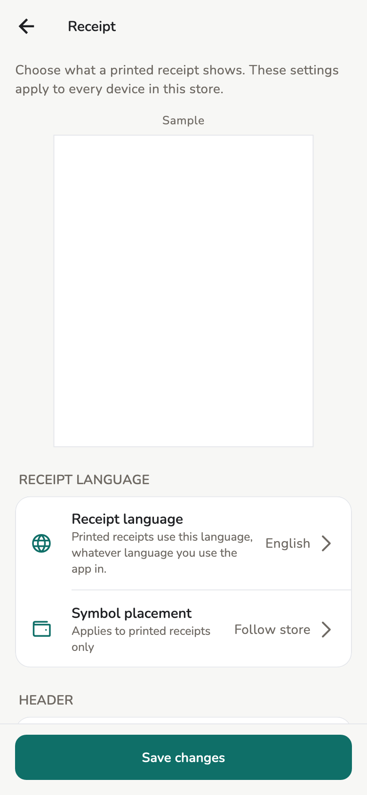

# Printing

What comes out of the printer, and what decides it.

## Overview

**Print** sits at the bottom of every invoice. There are two ways it can go
out: as a PDF through your device's own print dialog, which needs no setup at
all, or straight to a Bluetooth thermal printer you have paired with Salony.

## Usage

Which document you get depends on the invoice, not on a menu:

| Invoice | What prints |
| --- | --- |
| Draft | **PROVISIONAL BILL** — what is owed, with no payment method and no amount paid |
| Approved, printed for the first time | The receipt, no banner |
| Approved, printed before | The same receipt stamped **COPY** |

A voided or refunded invoice also carries **VOIDED**, **REFUNDED** or
**PARTIALLY REFUNDED** across it, so the paper matches the record.

Applied extra fees print as their own lines, using the name stored on the
bill, then the total. A waived or zero fee is omitted, like a zero tip. The
paper does not call it a bank or card-processor fee.

!!! warning "Why reprints are stamped"

    An unmarked reprint can be brought back to claim a second refund. Only
    the first print of an approved invoice comes out unmarked, and Salony
    remembers which one that was. Provisional bills do not count: print the
    draft as many times as the customer asks and the receipt is still an
    original.

The share icon in the invoice title bar sends the same PDF and records
nothing. Sending a customer their receipt in a chat does not use up the
original, so the paper copy you print afterwards is still unmarked.

## Thermal printers

Salony can send a receipt straight to a thermal printer, without the system
print dialog. **Settings → Thermal printer**, then **Search for printers**. The
printer you pick is remembered on **that device only** — the phone at the
counter and the tablet in the back each have their own.

There are two ways to reach one:

| Route | Suits |
| --- | --- |
| **Bluetooth** | A handheld printer beside the till. Pairs from phones and tablets only |
| **The salon network** | A counter printer on Ethernet or Wi-Fi. Pairs from any device, Mac and Windows included |

Once a printer is paired, **Print** asks which one you meant.

**Print a test receipt** sends a five-line sample and reports how long it took.
That number is the one worth reading: a receipt is 20–60 KB of pixels and
Bluetooth Low Energy is not fast. A few seconds is fine at a counter; twenty is
not. A network printer is usually much quicker, but print the test once anyway.

### Which Bluetooth printers work

The printer must speak **Bluetooth Low Energy (BLE)**. Many cheap thermal
printers speak only the older Bluetooth Classic (SPP), and those cannot be
used — on any phone.

The quickest way to tell before you buy: **if the listing says "not compatible
with iPhone", it will not work with Salony either.** iPhones cannot reach an
SPP printer, so a vendor ruling out iOS is telling you which kind it is.

| Printer | Works |
| --- | --- |
| GOOJPRT PT-210 | Yes. 58 mm, widely sold, inexpensive |
| MTP-3 / MPT-II | Yes. 58 mm handheld |
| PeriPage | Yes, though it is a label printer rather than a receipt printer |
| "Android and Windows only, not iOS" models | No |

!!! note "This table is read from specifications, not from test prints"

    The **Works** column follows the Bluetooth profile each family is
    documented to expose; Salony has not been connected to every model on it.
    Whichever printer you buy, print a test receipt on the first day.

If your printer is not listed, check it in a minute with a free Bluetooth
scanner app — **nRF Connect** or **LightBlue**. Turn the printer on and scan.
If it appears with a name, Salony can almost certainly use it. If it does not
appear at all, it is an SPP printer and cannot be used.

### Printers on the salon network

The printer must accept raw print jobs on **port 9100**. Most counter thermal
printers with a network port do; the specification sheet usually calls it
"raw", "JetDirect" or "Port 9100".

Press **Search for printers** and any printer that announces itself on the
network appears with its address. Plenty of cheap ones announce nothing. For
those, use **Add a printer by address** and type the printer's IP address —
`192.168.1.50`, for example. You do not need the port; Salony assumes 9100.
If the printer uses another one, type `192.168.1.50:9110`.

Where to find the address: most printers have a button that prints their own
configuration page, or you can read it off the router's admin page.

!!! tip "Give the printer a fixed address"

    Salony remembers exactly the address you saved. Routers hand out addresses
    that can change, and the day it changes Salony reports that the printer did
    not answer and you have to pair it again. Reserving a fixed address for the
    printer on the router settles that once.

The printer and the device running Salony must be on the same network. A
salon's guest Wi-Fi is usually walled off from the internal one, so a device on
guest Wi-Fi will not see the printer.

### Which devices can pair one

| Device | Bluetooth printer | Network printer | System print dialog |
| --- | --- | --- | --- |
| Android 12 and newer | Yes | Yes | Yes |
| Android 11 and older | No | Yes | Yes |
| iPhone, iPad | Yes | Yes | Yes |
| Mac, Windows | No | Yes | Yes |

Android 11 and older cannot search for Bluetooth printers, because Android
required a Location permission for that and Salony does not ask for one. A
network printer is not affected.

A Mac or PC cannot pair a Bluetooth printer inside Salony, which is also the
least likely printer for a front desk to have. A network printer pairs
normally, and that is exactly the printer a desktop salon owns.

**A Mac or Windows PC can also print through the printer's own driver**, rather
than through Salony. Install it the way you would any printer, and it appears
in the print dialog like the rest. What Salony sends is an 80 mm roll, not a
page, so it comes out receipt-shaped rather than as a receipt marooned on a
sheet of A4. This route is the only one for a printer on USB.

## Configuration

**Settings → Receipt**, Owner or Manager. It applies to every device in the
store, not only the one you change it on.

<figure class="shot-phone" markdown>
{ loading=lazy }
<figcaption>Settings → Receipt</figcaption>
</figure>

- **Receipt language** — separate from the app language. Staff working in
  English still hand out Vietnamese receipts.
- **Symbol placement** — printed receipts only. **Follow store** keeps the
  store's setting.
- **Header** — Store logo, Address, Phone number, Tax ID.
- **Details** — Staff name, Customer name, Tax breakdown, Payment method.
  Payment method never prints on a provisional bill.
- **Header text** and **Footer text** — free lines under the store name and
  at the foot, for example a thank-you.

A sample receipt at the top of the screen updates as you change these,
before you save. It is not a real invoice and does not use up the original.

One **Save changes** at the bottom covers the whole screen.

## Limitations

Thermal printing goes over Bluetooth or the salon network. A printer on USB has
to go through the system print dialog instead.

The chosen printer is remembered per device. A salon with one shared network
printer still pairs it once on each device.

The sample on Settings → Receipt is the template preview. A thermal printer
still has **Print a test receipt** the first time, which times the hardware
rather than showing the layout.

The receipt language offers two options, English and Vietnamese. The reason is
the PDF path: its font has no Chinese glyphs, so a Chinese receipt would come
out as empty boxes. The thermal path paints pixels and in principle would not
have that problem, but nobody has printed one on paper to confirm it, and the
two paths share one setting. So the list stops at two.

## Related pages

- [Invoices and receipts](invoices.md)
- [Store settings](../admin/store-settings.md)
- [Desktop](../admin/desktop.md)
