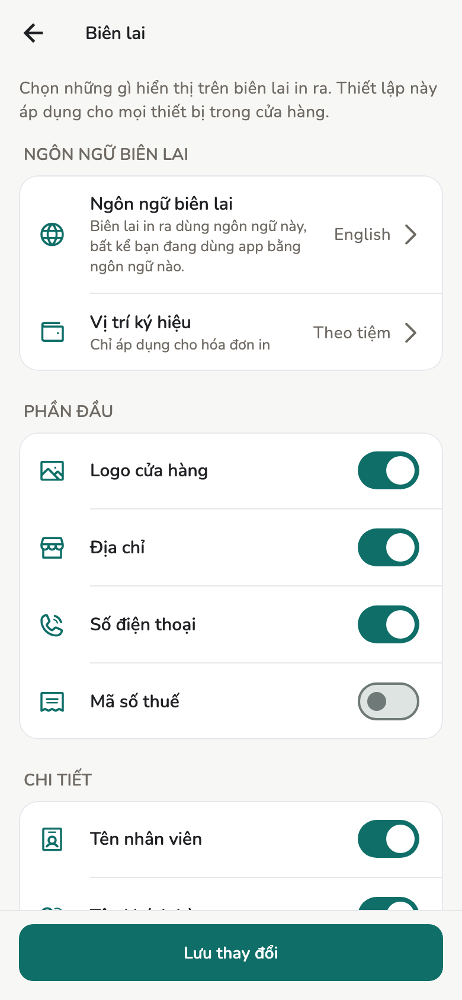

# In biên lai

Máy in ra tờ gì, và cái gì quyết định điều đó.

## Tổng quan

Nút **In** nằm dưới cùng mỗi hóa đơn. Có hai đường ra: xuất PDF rồi giao cho
hộp thoại in của máy, cách này không cần cài gì; hoặc gửi thẳng tới máy in
nhiệt bạn đã ghép với Salony, qua Bluetooth hoặc qua mạng của tiệm.

## Cách làm

In ra tờ gì là do trạng thái hóa đơn quyết định, không phải do bạn chọn:

| Hóa đơn | In ra |
| --- | --- |
| Nháp | **PHIẾU TẠM TÍNH**: số tiền phải trả, không có phương thức thanh toán, không có số đã thu |
| Đã duyệt, in lần đầu | Biên lai, không đóng dấu gì |
| Đã duyệt, đã in rồi | Vẫn biên lai đó nhưng đóng dấu **BẢN SAO** |

Hóa đơn đã hủy hoặc đã hoàn tiền còn in kèm dòng **ĐÃ HỦY**, **ĐÃ HOÀN TIỀN**
hoặc **ĐÃ HOÀN MỘT PHẦN**, để tờ giấy khớp với sổ sách.

!!! warning "Vì sao bản in lại bị đóng dấu"

    Một bản in lại không đánh dấu có thể bị mang tới đòi hoàn tiền lần thứ
    hai. Chỉ lần in đầu tiên của hóa đơn đã duyệt mới sạch dấu, và Salony nhớ
    lần đó là lần nào. Phiếu tạm tính không tính: in nháp bao nhiêu lần khách
    muốn cũng được, biên lai sau đó vẫn là bản gốc.

Nút chia sẻ trên thanh tiêu đề hóa đơn gửi đúng file PDF đó nhưng không ghi
nhận gì. Gửi biên lai cho khách qua tin nhắn không tiêu mất bản gốc, nên tờ
giấy bạn in sau đó vẫn sạch dấu.

## Máy in nhiệt

Salony gửi thẳng biên lai tới máy in nhiệt, không qua hộp thoại in của hệ điều
hành. Vào **Cài đặt → Máy in nhiệt**, bấm **Tìm máy in**. Máy in bạn chọn chỉ
nhớ **trên máy đó**: điện thoại ngoài quầy và máy tính bảng bên trong mỗi máy
có máy in riêng.

Có hai đường tới máy in nhiệt:

| Đường | Hợp với |
| --- | --- |
| **Bluetooth** | Máy in cầm tay để cạnh quầy. Chỉ ghép được từ điện thoại và máy tính bảng |
| **Mạng của tiệm** | Máy in để bàn cắm dây mạng hoặc nối Wi-Fi. Ghép được từ mọi máy, kể cả Mac và Windows |

Ghép xong rồi thì nút **In** sẽ hỏi bạn in bằng đường nào.

**In thử một biên lai** gửi một bản mẫu 5 dòng rồi báo mất bao nhiêu giây. Con
số đó đáng đọc: một biên lai là 20–60 KB điểm ảnh, mà Bluetooth Low Energy thì
không nhanh. Vài giây là dùng được ngoài quầy, hai chục giây thì không. Máy in
nối mạng thường nhanh hơn hẳn, nhưng vẫn nên in thử một lần để biết chắc.

### Máy in Bluetooth nào dùng được

Máy in phải chạy **Bluetooth Low Energy (BLE)**. Nhiều máy in nhiệt giá rẻ chỉ
chạy Bluetooth Classic (SPP) đời cũ, loại đó không dùng được, trên điện thoại
nào cũng vậy.

Cách nhận biết nhanh nhất trước khi mua: **nếu người bán ghi "không hỗ trợ
iPhone" thì máy đó cũng không chạy với Salony.** iPhone không nói chuyện được
với máy in SPP, nên ghi vậy tức là họ đang nói cho bạn biết máy thuộc loại nào.

| Máy in | Dùng được |
| --- | --- |
| GOOJPRT PT-210 | Được. 58 mm, bán nhiều, giá rẻ |
| MTP-3 / MPT-II | Được. 58 mm cầm tay |
| PeriPage | Được, nhưng đây là máy in nhãn chứ không phải in biên lai |
| Loại ghi "chỉ Android và Windows, không iOS" | Không |

!!! note "Bảng này suy ra từ tài liệu, chưa phải kết quả in thử"

    Cột "Dùng được" dựa trên kiểu kết nối BLE mà từng dòng máy công bố, chứ
    Salony chưa cắm thử từng máy. Mua máy nào cũng nên in thử một biên lai
    ngay hôm đầu.

Máy in của bạn không có trong bảng thì kiểm tra trong một phút bằng app quét
Bluetooth miễn phí: **nRF Connect** hoặc **LightBlue**. Bật máy in lên rồi
quét. Thấy máy in hiện ra kèm tên thì gần như chắc chắn Salony dùng được.
Không thấy gì thì đó là máy SPP, không dùng được.

### Máy in nối mạng tiệm

Máy in phải nhận lệnh in thô ở **cổng 9100**. Đa số máy in nhiệt để quầy có
cổng mạng đều vậy, và trong tờ thông số họ hay ghi là "raw", "JetDirect" hoặc
"Port 9100".

Bấm **Tìm máy in**, máy in nào tự báo tên trên mạng sẽ hiện ra kèm địa chỉ.
Nhiều máy in rẻ không tự báo gì cả. Lúc đó dùng **Thêm máy in bằng địa chỉ** và
gõ địa chỉ IP của máy in, ví dụ `192.168.1.50`. Không cần gõ cổng, Salony tự
hiểu là 9100; máy in dùng cổng khác thì gõ `192.168.1.50:9110`.

Địa chỉ IP xem ở đâu: đa số máy in có nút tự in ra một tờ cấu hình, hoặc xem
trong trang quản lý của router.

!!! tip "Đặt IP cố định cho máy in"

    Salony nhớ đúng địa chỉ bạn đã lưu. Router cấp IP động, hôm nào đổi số thì
    Salony sẽ báo máy in không trả lời, và bạn phải ghép lại. Đặt IP cố định
    cho máy in trong trang router là xong chuyện đó một lần.

Máy in và máy chạy Salony phải cùng một mạng. Wi-Fi khách của tiệm thường bị
tách riêng khỏi mạng trong, nên máy nối vào Wi-Fi khách sẽ không thấy máy in.

### Máy nào ghép được máy in

| Thiết bị | Máy in Bluetooth | Máy in nối mạng | Hộp thoại in của hệ điều hành |
| --- | --- | --- | --- |
| Android 12 trở lên | Được | Được | Được |
| Android 11 trở xuống | Không | Được | Được |
| iPhone, iPad | Được | Được | Được |
| Mac, Windows | Không | Được | Được |

Android 11 trở xuống không tìm được máy in Bluetooth, vì Android bắt phải có
quyền Vị trí mới quét được, mà Salony không xin quyền đó. Máy in nối mạng thì
không vướng chỗ này.

Mac và Windows không ghép được máy in Bluetooth ngay trong Salony, mà đó cũng
là loại máy in ít gặp nhất ở quầy lễ tân. Máy in nối mạng thì ghép bình thường,
và đó đúng là loại máy một tiệm dùng máy tính bàn đang có.

**Ngoài ra máy Mac hay máy Windows vẫn in được qua driver của chính máy in**,
không qua Salony. Cài driver như cài máy in bình thường, nó sẽ hiện trong hộp
thoại in cùng với các máy in khác. Salony gửi ra khổ cuộn 80mm chứ không phải
khổ trang, nên tờ in ra đúng dáng biên lai, không phải một cái biên lai nhỏ xíu
nằm giữa tờ A4. Đường này là đường duy nhất cho máy in cắm USB.

## Cấu hình

**Cài đặt → Biên lai**, cần Chủ tiệm hoặc Quản lý. Sửa ở một máy là áp dụng
cho mọi máy của tiệm.

<figure class="shot-phone" markdown>
{ loading=lazy }
<figcaption>Cài đặt → Biên lai</figcaption>
</figure>

- **Ngôn ngữ biên lai**: tách riêng khỏi ngôn ngữ app. Nhân viên xài app
  tiếng Anh vẫn đưa khách biên lai tiếng Việt.
- **Vị trí ký hiệu**: chỉ áp dụng cho hóa đơn in. Chọn **Theo tiệm** thì giữ
  nguyên thiết lập của tiệm.
- **Phần đầu**: Logo cửa hàng, Địa chỉ, Số điện thoại, Mã số thuế.
- **Chi tiết**: Tên nhân viên, Tên khách hàng, Chi tiết thuế, Phương thức
  thanh toán. Phương thức thanh toán không bao giờ in trên phiếu tạm tính.
- **Chữ phần đầu** và **Chữ chân trang**: dòng tự do đặt dưới tên tiệm và ở
  cuối tờ, ví dụ lời cảm ơn.

Một nút **Lưu thay đổi** ở dưới cùng lưu cả màn hình.

## Giới hạn

In nhiệt đi qua Bluetooth hoặc qua mạng của tiệm. Máy in cắm USB thì phải đi
qua hộp thoại in của hệ điều hành.

Máy in đã chọn chỉ nhớ trên máy đó. Tiệm có một máy in nối mạng dùng chung thì
mỗi máy vẫn phải tự ghép một lần.

Salony không có màn hình xem trước riêng: xem trước nằm ở hộp thoại in, còn in
nhiệt thì không có xem trước gì cả, nên lần đầu hãy dùng **In thử một biên
lai**.

Ngôn ngữ biên lai chỉ có hai lựa chọn: tiếng Anh hoặc tiếng Việt. Lý do nằm ở
đường PDF, vì font nó dùng không có chữ Trung, nên một tờ biên lai tiếng Trung
sẽ ra toàn ô vuông. Đường in nhiệt vẽ điểm ảnh nên về nguyên tắc không vướng
chỗ đó, nhưng chưa ai in thử ra giấy để xác nhận, mà hai đường lại dùng chung
một thiết lập. Vì vậy danh sách ngôn ngữ dừng ở hai.

## Trang liên quan

- [Hóa đơn và biên lai](invoices.md)
- [Cài đặt tiệm](../admin/store-settings.md)
- [Máy tính bàn](../admin/desktop.md)
