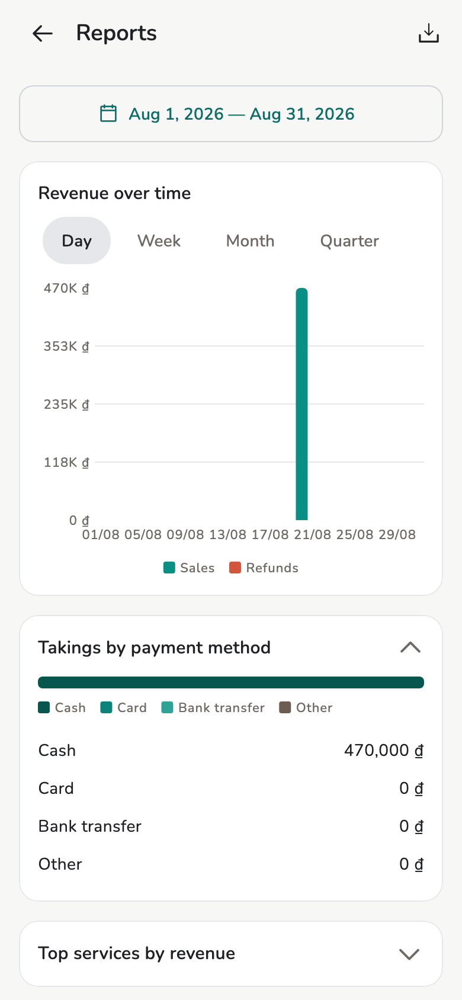
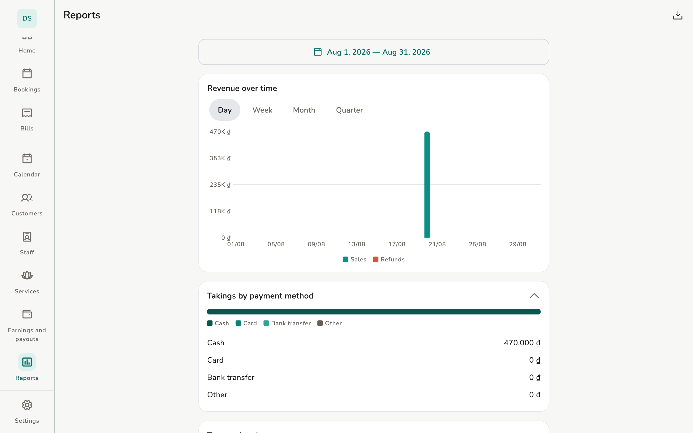

# Reports

Revenue, customer mix, CSV, on-device AI summary.

## Overview

Owner / Manager see the whole store. Staff: **My reports** — *theirs*, not
the store.

<figure class="shot-phone" markdown>
{ loading=lazy }
<figcaption>Phone</figcaption>
</figure>

<figure class="shot-wide" markdown>
{ loading=lazy }
<figcaption>Tablet and desktop</figcaption>
</figure>

## Usage

The page has: revenue by day / week / month / quarter / year (gross, refunds,
net); average ticket; tax, tips, commission, payouts; top services; missed
appointments; **Customer mix**; payment mix; staff performance
(owner/manager).

An empty range means there is no data in that window.

**Export** downloads a CSV on your device — not a cloud report emailed to
you.

**Analyse with AI** / **Automatic summary** runs on the device after the
model is downloaded. See [AI assistant](ai-assistant.md).

## Related pages

- [AI assistant](ai-assistant.md)
- [Earnings](earnings.md)
- [Customers](customers.md)
