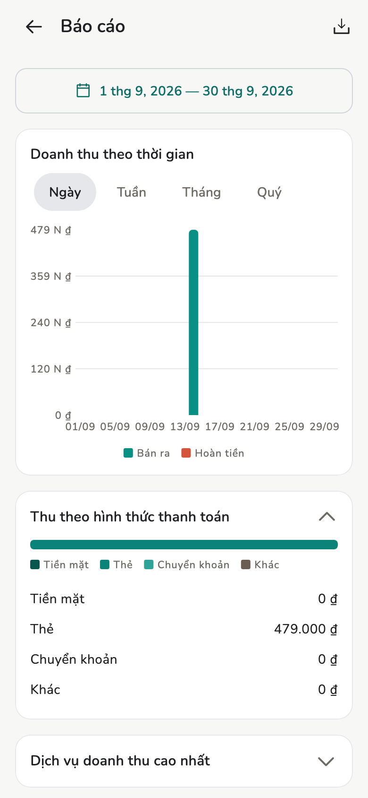

# Báo cáo

Doanh thu, cơ cấu khách, xuất CSV, tóm tắt AI ngay trên máy.

## Tổng quan

Chủ / Quản lý xem số cả tiệm. Nhân viên chỉ thấy **Báo cáo của tôi**.

<figure class="shot-phone" markdown>
{ loading=lazy }
<figcaption>Báo cáo</figcaption>
</figure>

## Cách làm

Trang này có doanh thu theo ngày, tuần, tháng, quý, năm (tổng thu, tiền hoàn,
thực thu). **Phí thêm đã thu** nằm ngay dưới doanh thu gộp (nằm trong tổng
thu, không bị trừ ra). Kèm theo: trung bình mỗi hóa đơn; thuế, tip, hoa hồng,
chi trả; dịch vụ chạy nhất (chỉ dòng dịch vụ, không gồm phí thêm); lịch khách
không tới; **Cơ cấu khách**; cơ cấu thanh toán (tổng hóa đơn, đã gồm phí
thêm); và hiệu suất nhân viên (chỉ Chủ tiệm và Quản lý thấy).

Khoảng trống nghĩa là chưa có dữ liệu trong khoảng ngày đó.

**Xuất** tải CSV trên máy bạn, không phải báo cáo cloud gửi email. CSV hóa
đơn có cột **Fees** giữa Tip và Commission; dòng hủy và hoàn là số âm.

**Phân tích bằng AI** và **Tóm tắt tự động** chạy ngay trên máy, sau khi tải
mô hình về. Xem [Trợ lý AI](ai-assistant.md).

## Trang liên quan

- [Trợ lý AI](ai-assistant.md)
- [Thu nhập và chi trả](earnings.md)
- [Khách hàng](customers.md)
