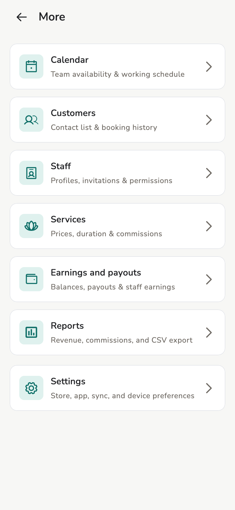

# Run the day

Day overview: next appointment, needs attention, quick actions.

## Overview

The **Home** tab is the owner/manager day screen. Staff have their own Home —
*their* bookings and earnings.

<figure class="shot-phone" markdown>
{ loading=lazy }
<figcaption>Phone</figcaption>
</figure>

<figure class="shot-wide" markdown>
{ loading=lazy }
<figcaption>Tablet and desktop</figcaption>
</figure>

## Concepts

- **Next up** — the coming appointment, with **Check-in** when it is time
- **Needs attention** — draft invoices waiting for approval, unassigned
  bookings
- **Quick actions** — new appointment, walk-in invoice, check-in, today’s
  schedule

Phone: bottom bar **Home**, **Bookings**, **Bills**, and **+**. **More** (menu
icon, top right) opens customers, staff, services, calendar, reports, and
settings.

Tablet / desktop: a side rail with the same screens.

Dark appearance: **Settings → Appearance → Dark** (app shots invert against
the docs theme).

<figure markdown>
{ loading=lazy }
<figcaption>More menu on a phone</figcaption>
</figure>

## Related pages

- [Appointments](appointments.md)
- [Invoices and receipts](invoices.md)
- [Store settings](../admin/store-settings.md)
