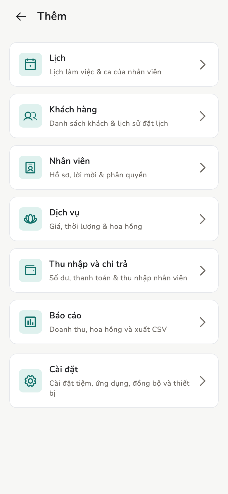

# Một ngày làm việc

Mở app buổi sáng: lịch kế tiếp, việc cần xử lý, thao tác nhanh.

## Tổng quan

Tab **Home** trong app là màn hình mở đầu ngày của **Chủ tiệm** và **Quản
lý**. Nhân viên có Home riêng, chỉ hiện lịch và thu nhập *của họ*.

<figure class="shot-phone" markdown>
{ loading=lazy }
<figcaption>Điện thoại</figcaption>
</figure>

<figure class="shot-wide" markdown>
{ loading=lazy }
<figcaption>Máy tính bảng và máy tính bàn</figcaption>
</figure>

## Khái niệm

- **Sắp tới** — lịch kế tiếp, nút **Check-in** khi tới lượt
- **Cần xử lý** — hóa đơn nháp chờ duyệt, lịch chưa gán nhân viên
- **Thao tác nhanh** — **Tạo lịch hẹn**, **Hóa đơn vãng lai**, Check-in,
  lịch hôm nay

Điện thoại: thanh dưới **Home**, **Đặt lịch**, **Hóa đơn**, nút **+**. Menu
**Thêm** (icon góc phải) mở khách, nhân viên, dịch vụ, lịch, báo cáo, cài đặt.

Máy tính bảng / máy tính bàn: menu dọc bên trái, cùng các màn hình.

Giao diện tối: **Cài đặt → Giao diện → Tối**. Ảnh trong tài liệu này chụp app
ở chế độ sáng.

<figure markdown>
{ loading=lazy }
<figcaption>Menu Thêm trên điện thoại</figcaption>
</figure>

## Trang liên quan

- [Lịch hẹn](appointments.md)
- [Hóa đơn và biên lai](invoices.md)
- [Cài đặt tiệm](../admin/store-settings.md)
