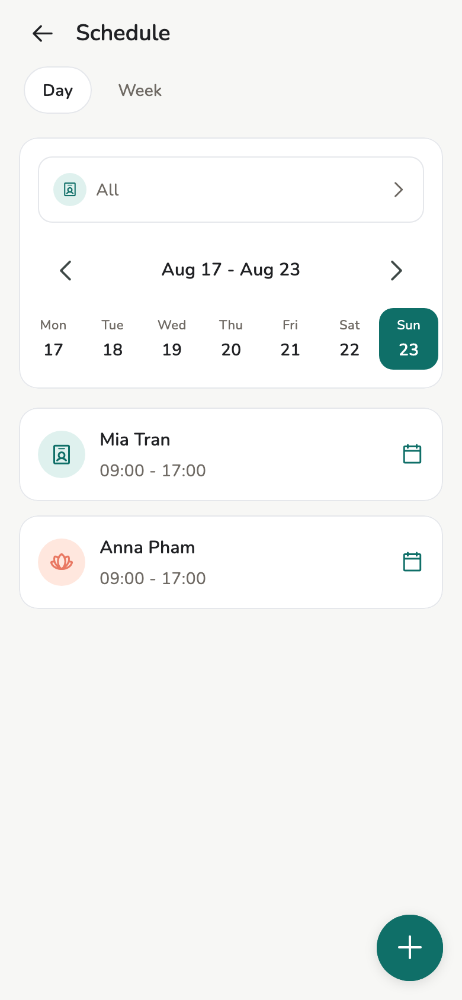
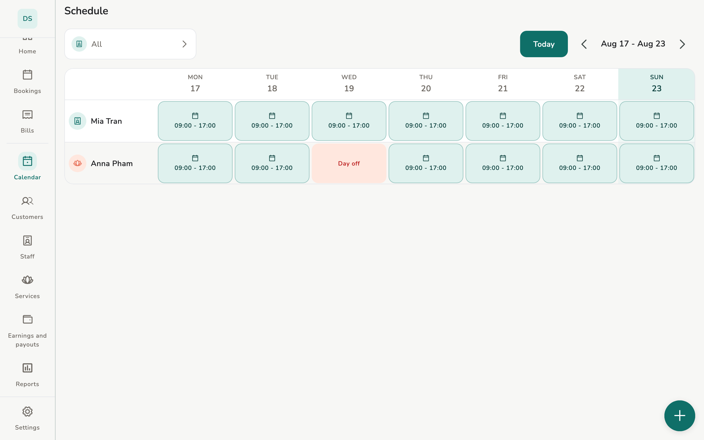

# Availability

Working hours, days off, and one-day changes: what the app checks when it asks
whether a staff member is free.

## Overview

**Calendar** (Owner / Manager) and **My schedule** (Staff).

<figure class="shot-phone" markdown>
{ loading=lazy }
<figcaption>Phone</figcaption>
</figure>

<figure class="shot-wide" markdown>
{ loading=lazy }
<figcaption>Tablet and desktop</figcaption>
</figure>

## Concepts

Priority when booking:

1. **Take time off or change hours**, set for one day
2. Availability the staff member registered
3. Their **Regular work schedule**
4. The store's default opening hours

## Usage

=== "Owner / Manager"

    Edit store hours, set **Take time off or change hours** per day, and see
    the whole team.

=== "Staff"

    Edit *their* availability. They do not edit someone else’s shifts.
    Opening hours does **not** let them create appointments.

[Appointments](appointments.md) can only be created when the assigned staff
member is free under those rules.

Desktop runs the full Calendar screen.

## Related pages

- [Appointments](appointments.md)
- [Staff](staff.md)
- [Store settings](../admin/store-settings.md)
