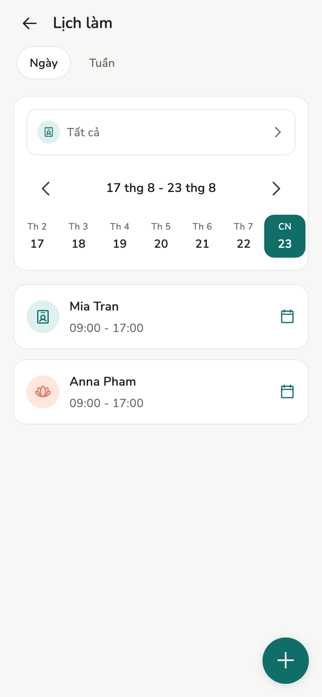
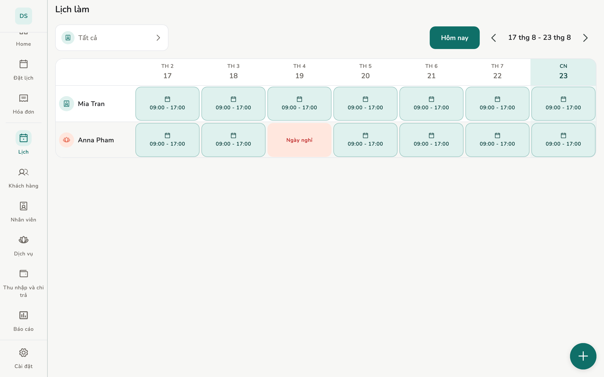

# Giờ rảnh

Ca làm, ngày nghỉ, giờ lệch một ngày: app dùng các mục này khi hỏi nhân
viên đó còn trống không.

## Tổng quan

Chủ / Quản lý mở **Lịch**. Nhân viên mở **Lịch làm việc của tôi**.

<figure class="shot-phone" markdown>
{ loading=lazy }
<figcaption>Điện thoại</figcaption>
</figure>

<figure class="shot-wide" markdown>
{ loading=lazy }
<figcaption>Máy tính bảng và máy tính bàn</figcaption>
</figure>

## Khái niệm

Thứ tự ưu tiên khi đặt lịch:

1. **Nghỉ hoặc đổi giờ** đặt riêng cho một ngày
2. Giờ rảnh nhân viên tự đăng ký
3. **Lịch làm cố định** của người đó
4. Giờ mở cửa mặc định của tiệm

## Cách làm

=== "Chủ tiệm / Quản lý"

    Sửa giờ mở cửa của tiệm, đặt **Nghỉ hoặc đổi giờ** cho từng ngày, xem cả đội.

=== "Nhân viên"

    Sửa giờ *họ* rảnh. Không sửa ca người khác. Tự mở giờ **không** cho phép
    họ tạo lịch hẹn.

[Lịch hẹn](appointments.md) chỉ tạo được khi nhân viên được gán đang rảnh
theo các quy tắc trên.

Trên máy tính bàn, màn **Lịch** có đầy đủ chức năng.

## Trang liên quan

- [Lịch hẹn](appointments.md)
- [Nhân viên](staff.md)
- [Cài đặt tiệm](../admin/store-settings.md)
