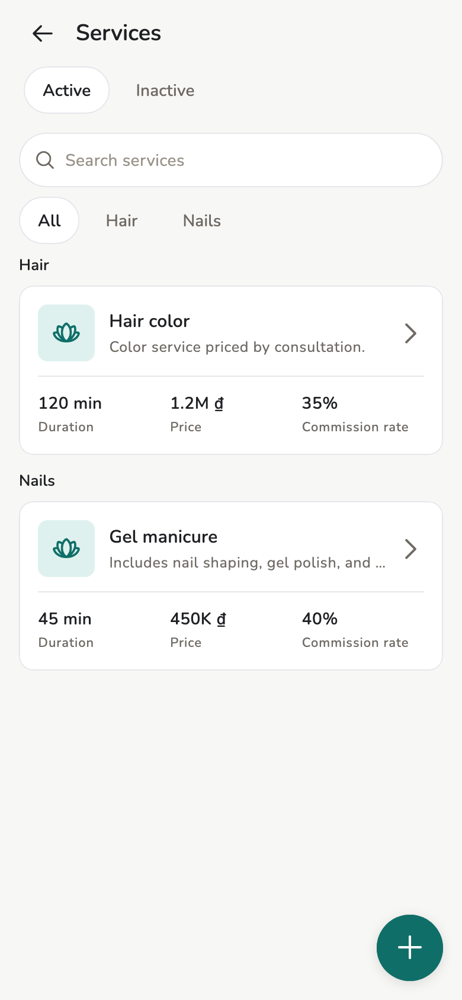
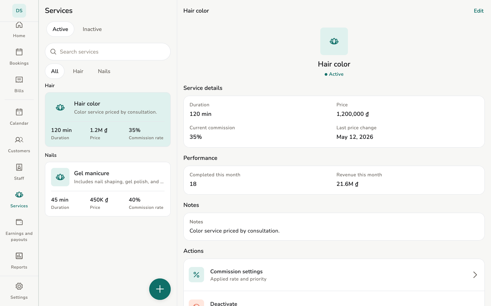
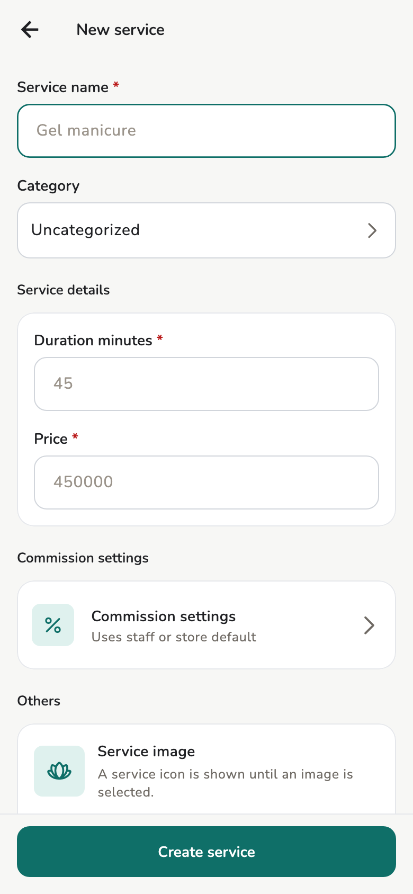
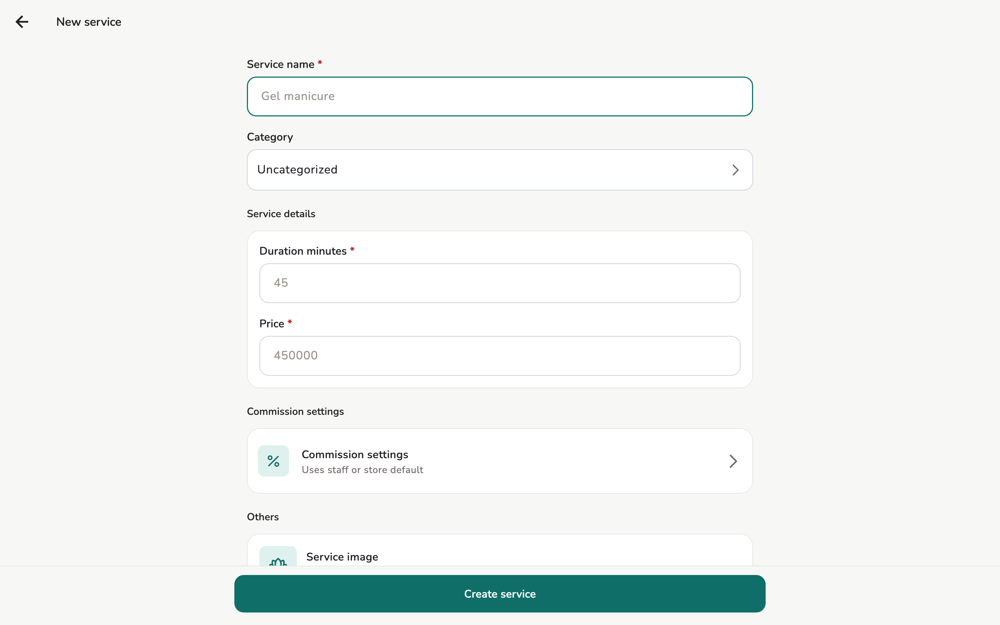
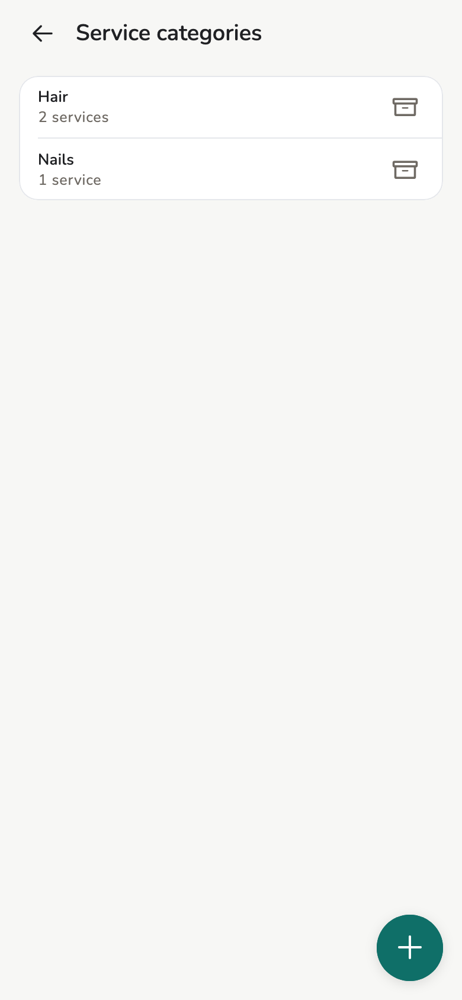
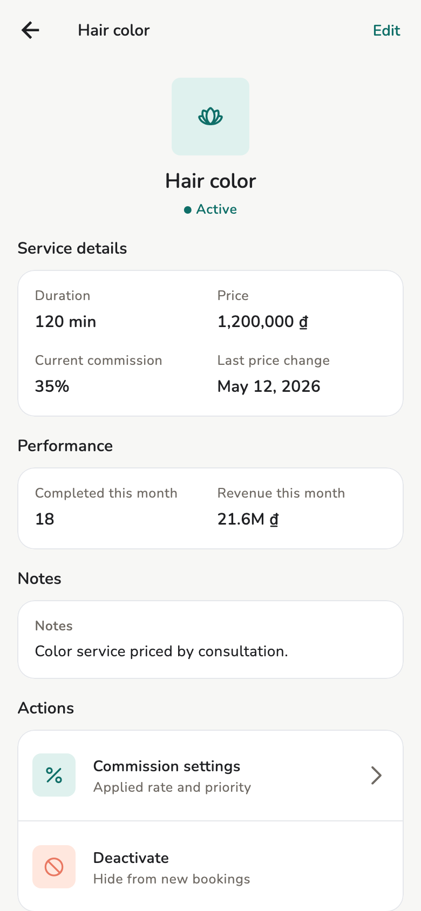
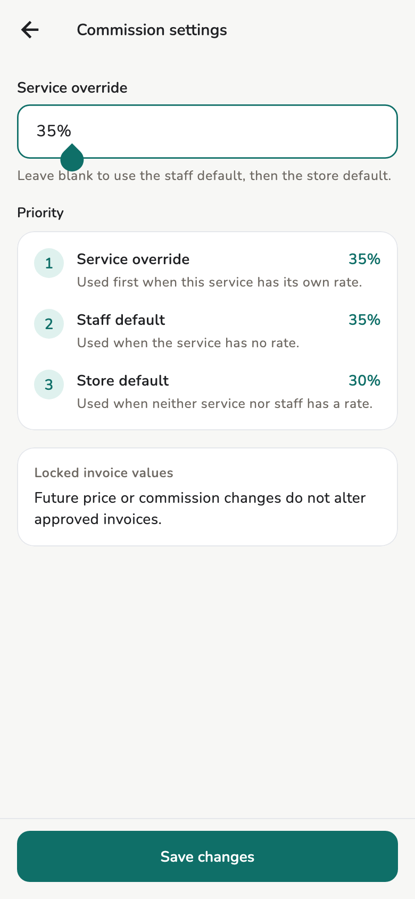

# Services and commission

Create a service, categories, price, commission %. **Owner** and **Manager**
have full catalog access.

## Overview

Owner / Manager create, edit, change price, deactivate/restore, manage
categories, and import CSV. Staff use the list when drafting bills — they
do not edit the catalog.

<figure class="shot-phone" markdown>
{ loading=lazy }
<figcaption>Phone</figcaption>
</figure>

<figure class="shot-wide" markdown>
{ loading=lazy }
<figcaption>List and detail on tablet</figcaption>
</figure>

## Usage

### Create a service

1. Open **Services**.
2. Tap **+** / **Add service**.
3. **Service name** is required.
4. **Category** is optional — **Uncategorized**, or an existing category.
5. **Duration minutes** and **Price** are required.
6. **Commission settings** if this service differs from the default.
7. Optional photo. **Create service**.

<figure class="shot-phone" markdown>
{ loading=lazy }
<figcaption>Phone</figcaption>
</figure>

<figure class="shot-wide" markdown>
{ loading=lazy }
<figcaption>Tablet and desktop</figcaption>
</figure>

Changing a price does **not** rewrite approved invoices. An invoice keeps the
snapshot from approval.

### Categories

On the form, open **Category** → **Manage categories**. Add groups (Hair,
Nails) so booking / bill forms stay short.

<figure markdown>
{ loading=lazy }
<figcaption>Choose category</figcaption>
</figure>

<figure markdown>
{ loading=lazy }
<figcaption>Manage categories: each row carries its service count</figcaption>
</figure>

Archiving a category does not delete invoice history that used that service.

### Detail and commission

Tap a service for duration, price, performance. **Commission settings** on
the detail (or on the create form):

<figure markdown>
{ loading=lazy }
<figcaption>Service detail</figcaption>
</figure>

<figure markdown>
{ loading=lazy }
<figcaption>Per-service commission</figcaption>
</figure>

## Concepts

Order, also shown in **Settings → Commission settings**:

1. % on the **service** if set (override)
2. else % on the **staff member**
3. else the store **default commission rate**

On approve, the commission amount **freezes into the snapshot**. Changing the
rate later does not redo old bills.

## Related pages

- [Store settings](../admin/store-settings.md)
- [Invoices and receipts](invoices.md)
- [Earnings](earnings.md)
