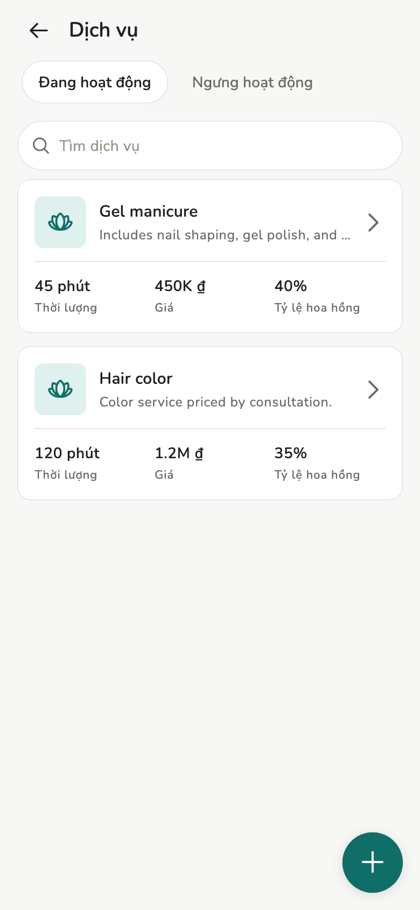
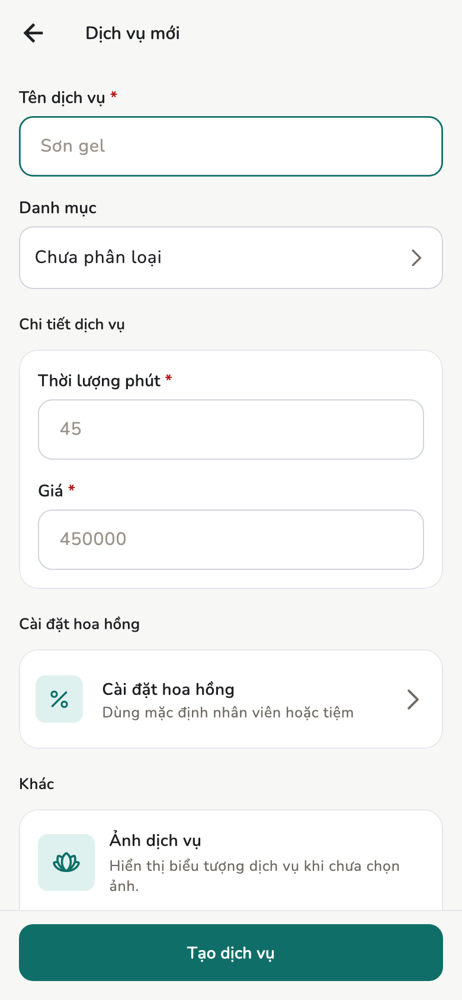
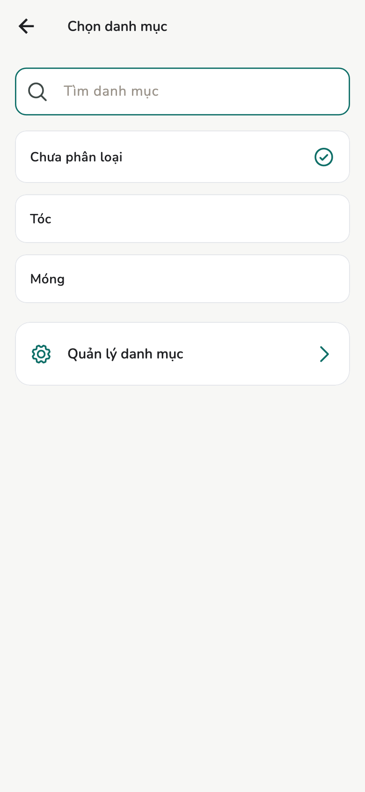
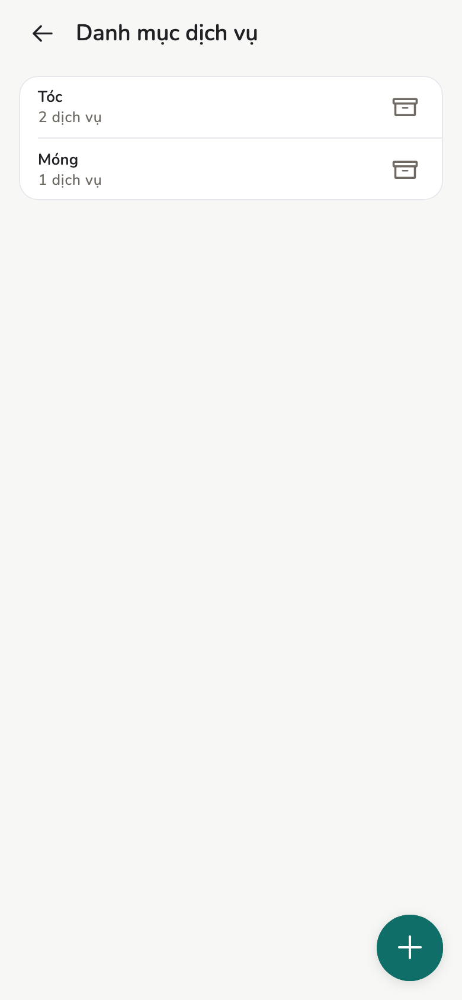
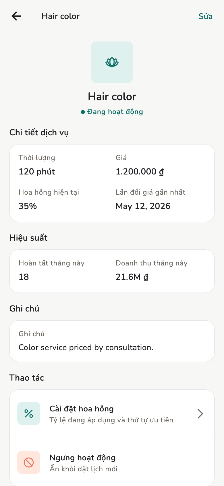
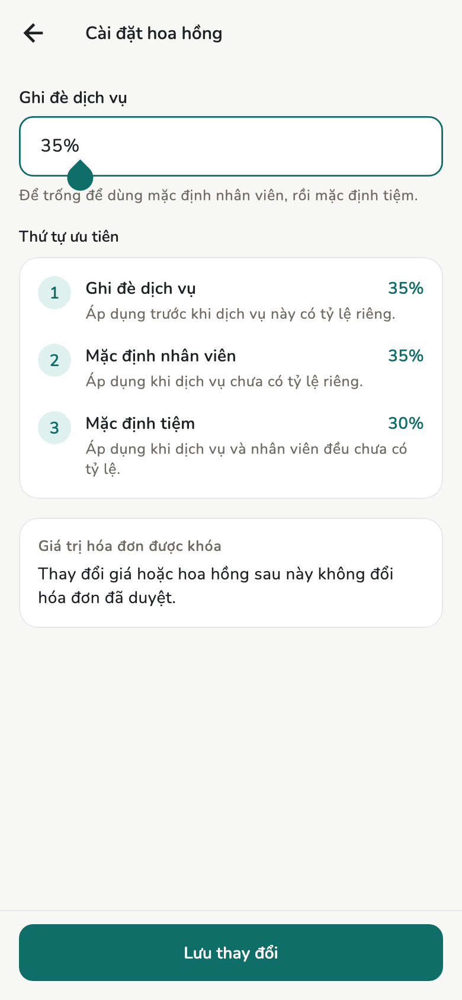

# Dịch vụ và hoa hồng

Tạo dịch vụ, danh mục, giá, % hoa hồng. **Chủ tiệm** và **Quản lý** làm được
hết trên danh mục dịch vụ.

## Tổng quan

Chủ / Quản lý tạo, sửa, đổi giá, ngưng hoặc bật lại, quản lý danh mục, nhập
CSV. Nhân viên chỉ dùng danh sách khi lập hóa đơn nháp, không sửa được.

<figure class="shot-phone" markdown>
{ loading=lazy }
<figcaption>Dịch vụ</figcaption>
</figure>

## Cách làm

### Tạo dịch vụ

1. Mở **Dịch vụ**.
2. Bấm **+** / **Thêm dịch vụ**.
3. **Tên dịch vụ** bắt buộc.
4. **Danh mục** tuỳ chọn — **Chưa phân loại**, hoặc một danh mục có sẵn.
5. **Thời lượng phút** và **Giá** bắt buộc.
6. **Cài đặt hoa hồng** nếu dịch vụ này khác mặc định.
7. Ảnh tuỳ chọn. **Tạo dịch vụ**.

<figure class="shot-phone" markdown>
{ loading=lazy }
<figcaption>Dịch vụ mới</figcaption>
</figure>

Đổi giá **không** sửa hóa đơn đã duyệt. Hóa đơn giữ snapshot lúc duyệt.

### Danh mục

Trên form, mở **Danh mục** → **Quản lý danh mục**. Thêm nhóm (ví dụ Tóc,
Móng) để form đặt lịch / hóa đơn gọn hơn.

<figure markdown>
{ loading=lazy }
<figcaption>Chọn danh mục</figcaption>
</figure>

<figure markdown>
{ loading=lazy }
<figcaption>Quản lý danh mục: mỗi dòng kèm số dịch vụ đang có</figcaption>
</figure>

Xoá / lưu trữ danh mục không xoá lịch sử hóa đơn đã dùng dịch vụ đó.

### Chi tiết và hoa hồng

Bấm một dịch vụ để xem thời lượng, giá, hiệu suất. **Cài đặt hoa hồng** trên
chi tiết (hoặc trên form lúc tạo):

<figure markdown>
{ loading=lazy }
<figcaption>Chi tiết dịch vụ</figcaption>
</figure>

<figure markdown>
{ loading=lazy }
<figcaption>Hoa hồng theo dịch vụ</figcaption>
</figure>

## Khái niệm

Thứ tự, cũng hiện trong **Cài đặt → Cài đặt hoa hồng**:

1. % trên **dịch vụ** nếu có (ghi đè)
2. Không thì % trên **nhân viên**
3. Không thì **tỷ lệ hoa hồng mặc định** của tiệm

Khi duyệt hóa đơn, số hoa hồng **chốt vào snapshot**. Đổi % sau không làm lại
hóa đơn cũ.

## Trang liên quan

- [Cài đặt tiệm](../admin/store-settings.md)
- [Hóa đơn và biên lai](invoices.md)
- [Thu nhập và chi trả](earnings.md)
