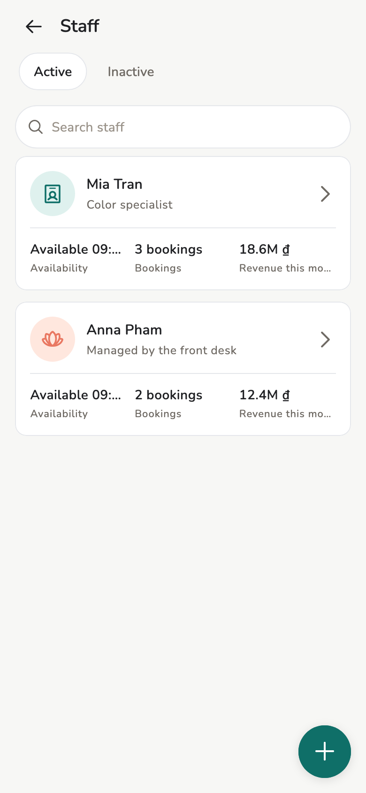
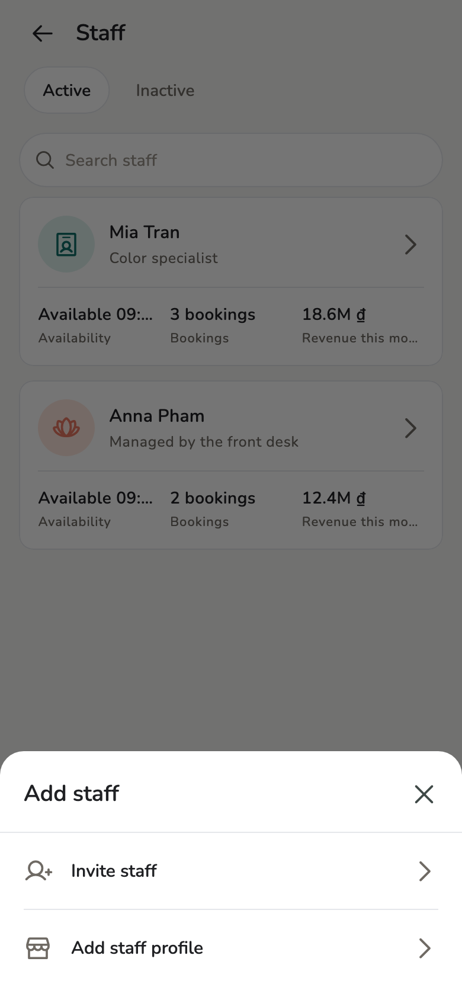
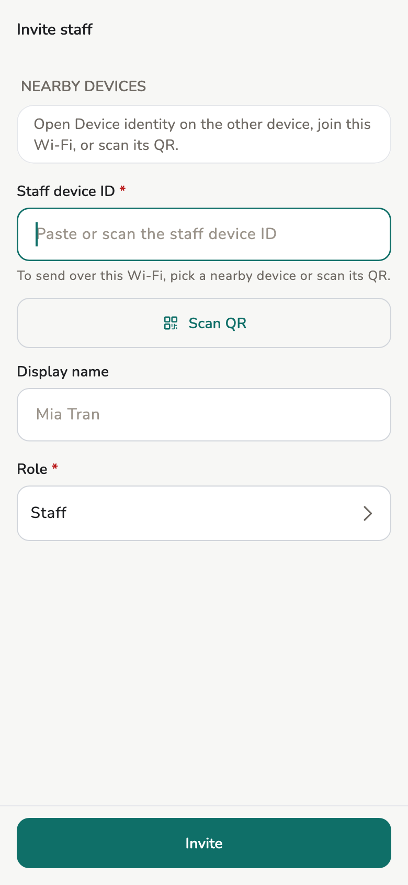
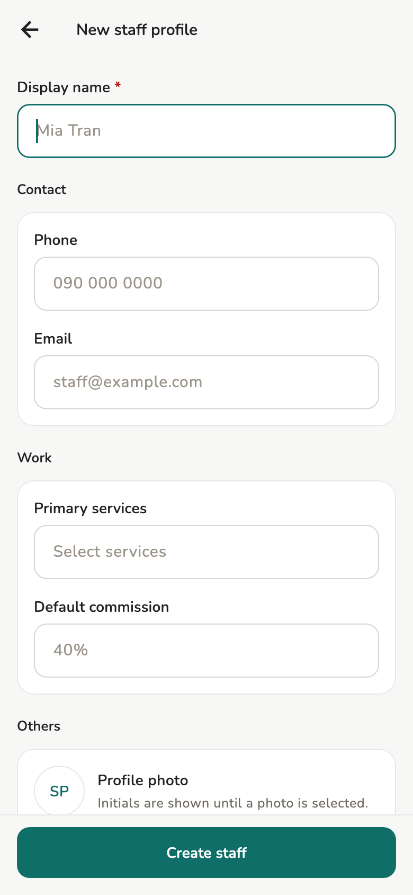
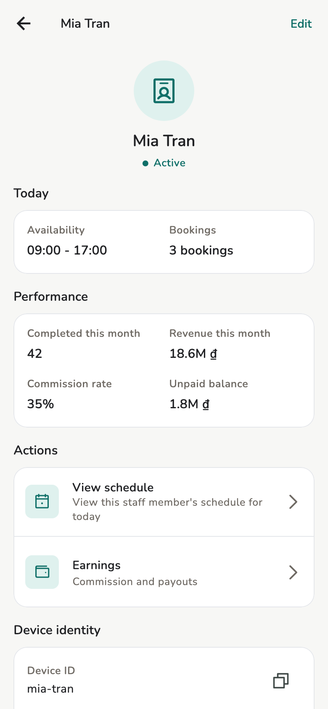

# Staff

Invite a real person, add a virtual profile, change roles. Do this before you
book.

## Overview

Owner and Manager **invite** people and create virtual staff. **Change role**
and **Staff bookings** are **Owner** only.

<figure class="shot-phone" markdown>
{ loading=lazy }
<figcaption>Staff</figcaption>
</figure>

## Concepts

Full matrix: [Roles](../reference/roles.md).

- One device — one identity — can be Owner in store A and Staff in store B.
- A **real person** has an identity on their device, can sign events, and
  uses that device.
- **Virtual staff** is a profile for bookings / commission. **Not** an
  identity, does not sign events, has no device to “log in”. Do not confuse
  it with *your* second device — [Devices and sync](../admin/devices.md).
- **Staff bookings**: **Only own** or **Whole store**. It does not change who
  can create appointments.

## Usage

Open **Staff**, tap **+** / **Add staff**. Two choices:

<figure markdown>
{ loading=lazy }
<figcaption>Add staff</figcaption>
</figure>

### Invite staff (a real person)

Two devices, at the same time:

1. **Their device:** **Settings → Device identity**. Keep that screen
   open.
2. **Yours:** **Staff → Add staff → Invite staff**.
3. Under **Nearby devices**, tap their name. Both screens show a
   six-digit code; tap **Codes match** on both. If they are not listed,
   **Scan QR**. Pasting the device ID alone cannot complete the first
   send on this Wi-Fi.
4. Optional display name. **Role** is required — **Staff** or **Manager**.
5. **Invite**. They accept on their device.

On a Mac or PC, **Scan QR** is hidden. Pick from **Nearby devices**.

<figure class="shot-phone" markdown>
{ loading=lazy }
<figcaption>Invite staff</figcaption>
</figure>

!!! tip "Promote to Owner later"

    The invite form only offers **Staff** / **Manager**. Change to Owner on
    the profile detail, when you already are Owner.

### Add a staff profile (virtual)

When they will not run Salony on a phone:

1. **Staff → Add staff → Add staff profile**.
2. **Display name** is required.
3. Phone, email, primary services, default commission % — optional.
4. **Create staff**.

<figure markdown>
{ loading=lazy }
<figcaption>Virtual staff profile</figcaption>
</figure>

Assign bookings and commission to this profile like a real person. They do
not open the app and do not sign events.

### Detail and change role

Tap a row for today, performance, earnings, schedule.

<figure markdown>
{ loading=lazy }
<figcaption>Staff detail</figcaption>
</figure>

Owner changes role on the detail screen. Staff **cannot** create appointments
regardless of that setting.

## Related pages

- [Roles](../reference/roles.md)
- [Availability](schedule.md)
- [Earnings](earnings.md)
