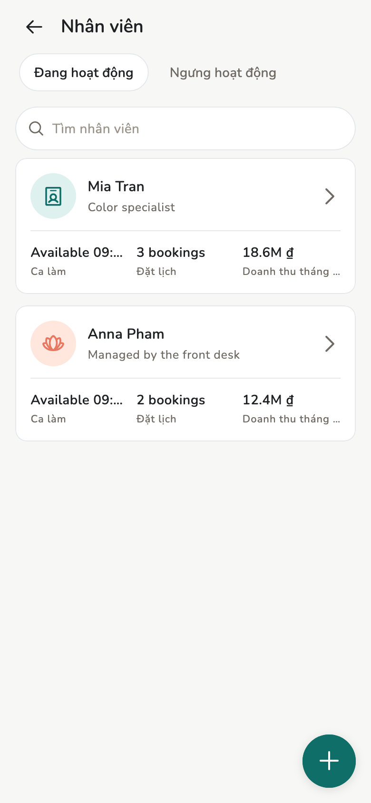
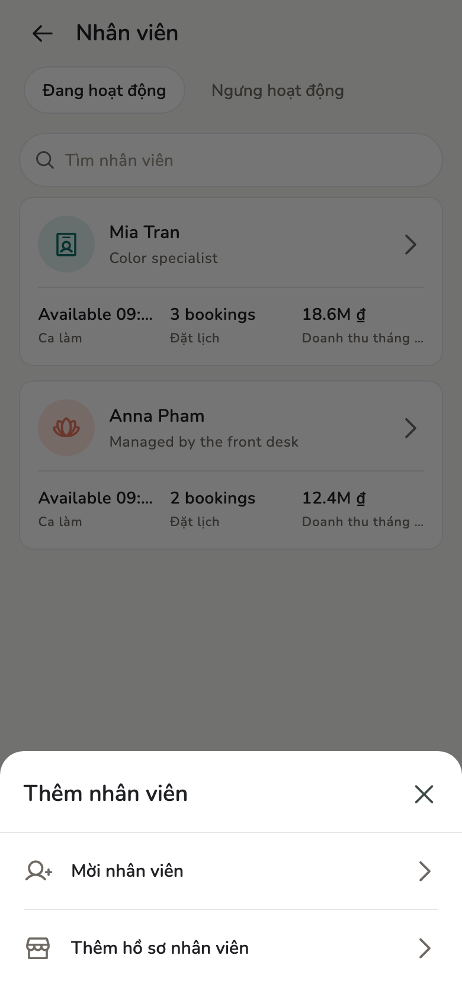
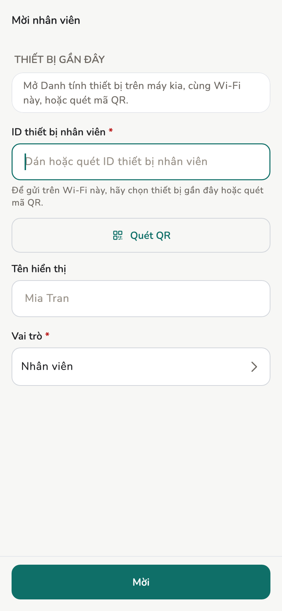
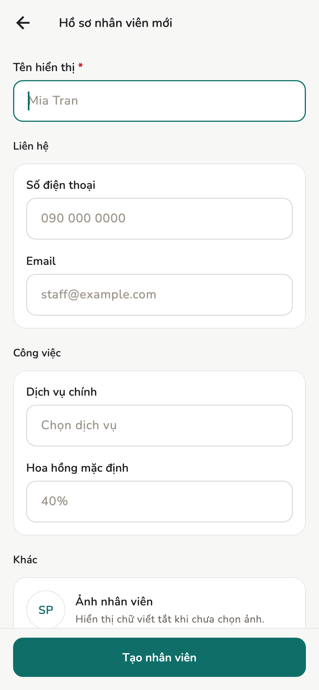
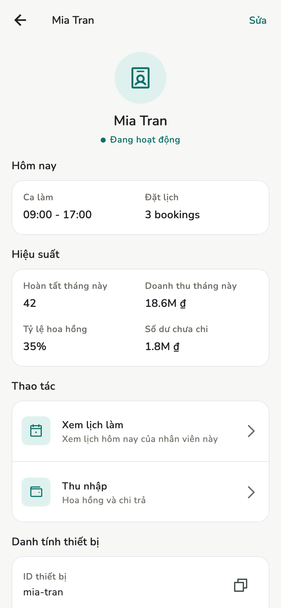

# Nhân viên

Mời người dùng app, tạo hồ sơ nhân viên ảo, đổi vai trò. Làm việc này trước
khi đặt lịch.

## Tổng quan

Chủ tiệm và Quản lý mời người và tạo nhân viên ảo. Chỉ **Chủ tiệm** đổi vai
trò và chỉnh **Lịch nhân viên**.

<figure class="shot-phone" markdown>
{ loading=lazy }
<figcaption>Nhân viên</figcaption>
</figure>

## Khái niệm

Bảng đầy đủ: [Vai trò](../reference/roles.md).

- Một máy ứng với một identity. Chính identity đó có thể là Chủ tiệm ở tiệm A
  mà chỉ là Nhân viên ở tiệm B.
- **Người thật** có identity trên máy của họ, ký được event, và vào tiệm bằng
  chính máy đó.
- **Nhân viên ảo** là hồ sơ gán lịch / hoa hồng. **Không** phải identity, không
  ký event, không có máy để “đăng nhập”. Đừng nhầm với máy thứ hai của *bạn*:
  xem [Thiết bị và đồng bộ](../admin/devices.md).
- **Lịch nhân viên**: **Chỉ của họ** hoặc **Cả tiệm**. Không đổi quyền tạo lịch
  hẹn.

## Cách làm

Mở **Nhân viên**, bấm **+** / **Thêm nhân viên**. Có hai lựa chọn:

<figure markdown>
{ loading=lazy }
<figcaption>Thêm nhân viên</figcaption>
</figure>

### Mời nhân viên (người thật)

Hai máy, cùng lúc:

1. **Máy họ:** **Cài đặt → Danh tính thiết bị**. Giữ màn này mở.
2. **Máy bạn:** **Nhân viên → Thêm nhân viên → Mời nhân viên**.
3. Trong **Thiết bị gần đây**, bấm tên họ. Hai màn hiện mã 6 số; bấm
   **Trùng mã** trên cả hai. Không thấy tên thì **Quét QR**. Chỉ dán ID
   thiết bị thì chưa gửi được trên Wi-Fi này.
4. Tên hiển thị tuỳ chọn. **Vai trò** bắt buộc: **Nhân viên** hoặc **Quản lý**.
5. **Mời**. Họ chấp nhận trên máy họ.

Trên Mac hoặc PC, **Quét QR** bị ẩn. Chọn từ **Thiết bị gần đây**.

<figure class="shot-phone" markdown>
{ loading=lazy }
<figcaption>Mời nhân viên</figcaption>
</figure>

!!! tip "Nâng lên Chủ tiệm sau"

    Form mời chỉ **Nhân viên** / **Quản lý**. Đổi thành Chủ trên chi tiết hồ
    sơ, khi đã là Chủ tiệm.

### Thêm hồ sơ nhân viên (ảo)

Khi người đó không mang điện thoại chạy Salony:

1. **Nhân viên → Thêm nhân viên → Thêm hồ sơ nhân viên**.
2. **Tên hiển thị** bắt buộc.
3. Điện thoại, email, dịch vụ chính, % hoa hồng mặc định — tuỳ chọn.
4. **Tạo nhân viên**.

<figure markdown>
{ loading=lazy }
<figcaption>Hồ sơ nhân viên ảo</figcaption>
</figure>

Gán lịch và hoa hồng cho hồ sơ này như người thật. Họ không mở app, không ký
event.

### Chi tiết và đổi vai trò

Bấm một hàng để mở chi tiết: ca hôm nay, hiệu suất, thu nhập, lịch làm.

<figure markdown>
{ loading=lazy }
<figcaption>Chi tiết nhân viên</figcaption>
</figure>

Chủ tiệm đổi vai trò trên chi tiết. Nhân viên **không** tạo lịch hẹn dù vai
trò thế nào.

## Trang liên quan

- [Vai trò](../reference/roles.md)
- [Giờ rảnh](schedule.md)
- [Thu nhập và chi trả](earnings.md)
