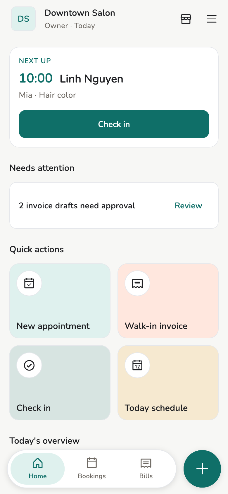
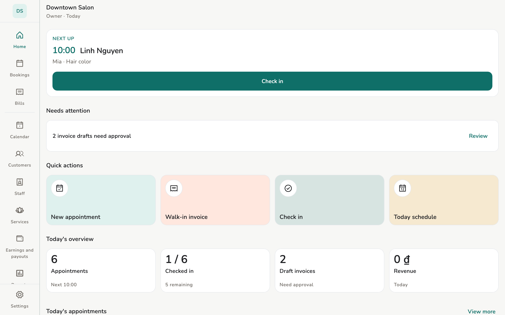

<figure class="device device--phone" markdown>

<figcaption>Phone</figcaption>
</figure>

<figure class="device device--tablet" markdown>

<figcaption>Tablet</figcaption>
</figure>

<figure class="device device--laptop" markdown>

<figcaption>Laptop</figcaption>
</figure>

# Salony

Salon software on your phone and computer. Appointments, invoices, and
customers stay **on your device** — not in the cloud.

[Get started](start/index.md){ .md-button .md-button--primary }
[How it works](tech/index.md){ .home-text-button }

## Key features { #features }

-   :material-laptop:{ .lg .middle } **Data on the device**

    ---

    Bookings, invoices, and customers live on the phone or computer you are
    holding. Salony does not keep a cloud copy.

    [:octicons-arrow-right-24: Local-first](tech/local-first.md)

-   :material-signal-off:{ .lg .middle } **Works offline**

    ---

    Book, bill, and read earnings as usual. Sync when a path returns.

    [:octicons-arrow-right-24: Run the day](guide/run-the-day.md)

-   :material-shield-lock:{ .lg .middle } **End-to-end encrypted sync**

    ---

    On shop Wi-Fi (or QR). 1.1.0 does not sync over the internet. When a
    Relay is hosted, it forwards ciphertext — it cannot read the salon.

    [:octicons-arrow-right-24: Devices and sync](admin/devices.md)

-   :material-key-variant:{ .lg .middle } **No login account**

    ---

    Each device has its own **identity**. Pair with a QR code. No email, no
    password.

    [:octicons-arrow-right-24: Identity](tech/identity.md)

## Getting started { #getting-started }

-   :material-download:{ .lg .middle } **Install**

    ---

    Test build for Android and Windows. No macOS or iOS yet.

    [:octicons-arrow-right-24: Downloads](admin/downloads.md)

-   :material-rocket-launch:{ .lg .middle } **First launch**

    ---

    Choose a language, create an identity on this device, then open or join
    a store.

    [:octicons-arrow-right-24: First launch](start/first-launch.md)

-   :material-flag-checkered:{ .lg .middle } **Before customers arrive**

    ---

    Write down the 24-word phrase, then add staff and services.

    [:octicons-arrow-right-24: First day](start/first-day.md)

## How it works { #how-it-works }

The publisher keeps no copy of your salon: nothing to read, nothing to sell,
and nothing to restore for you. In exchange, backup is yours — the 24-word
phrase and a data file. Lose the device without a backup and that device's
data is gone.

:material-cellphone: **Your device**

Appointments, invoices, and customers live here. Works offline.

**Pair with QR**

Wi-Fi or the Internet · end-to-end encrypted

:material-tablet: **A device you paired**

Until you pair it, that device can read nothing.

:material-shield-lock: **The Relay cannot read it**

A server only forwards ciphertext. The salon is not in the cloud. No email
account.

