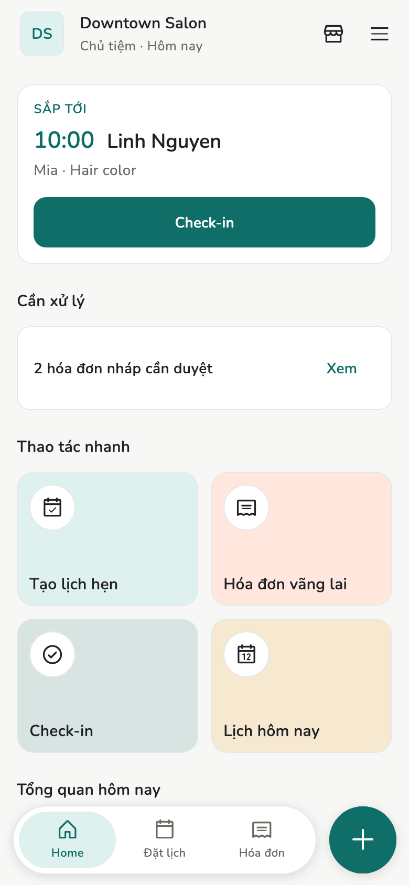

<figure class="device device--phone" markdown>

<figcaption>Điện thoại</figcaption>
</figure>

<figure class="device device--tablet" markdown>

<figcaption>Tablet</figcaption>
</figure>

<figure class="device device--laptop" markdown>

<figcaption>Laptop</figcaption>
</figure>

# Salony

App chạy tiệm trên điện thoại và máy tính. Lịch hẹn, hóa đơn, khách hàng
lưu **trên máy bạn**, không đưa lên cloud.

[Bắt đầu](start/index.md){ .md-button .md-button--primary }
[Salony chạy thế nào](tech/index.md){ .home-text-button }

## Tính năng chính { #features }

-   :material-laptop:{ .lg .middle } **Dữ liệu trên máy**

    ---

    Lịch, hóa đơn, khách nằm trên điện thoại hoặc máy tính bạn đang dùng.
    Salony không giữ bản sao trên cloud.

    [:octicons-arrow-right-24: Local-first](tech/local-first.md)

-   :material-signal-off:{ .lg .middle } **Mất mạng vẫn làm việc**

    ---

    Đặt lịch, lập hóa đơn, xem thu nhập như bình thường. Đồng bộ khi có mạng
    trở lại.

    [:octicons-arrow-right-24: Một ngày làm việc](guide/run-the-day.md)

-   :material-shield-lock:{ .lg .middle } **Đồng bộ có mã hoá đầu cuối**

    ---

    Cùng Wi-Fi tiệm (hoặc QR). Bản 1.0.0 chưa đồng bộ qua internet. Khi có
    Relay, nó chỉ chuyển ciphertext nên không đọc được nội dung tiệm.

    [:octicons-arrow-right-24: Thiết bị và đồng bộ](admin/devices.md)

-   :material-key-variant:{ .lg .middle } **Không cần đăng nhập**

    ---

    Mỗi máy có **identity** riêng. Ghép máy bằng mã QR. Không email, không
    mật khẩu.

    [:octicons-arrow-right-24: Identity](tech/identity.md)

## Bắt đầu { #getting-started }

-   :material-download:{ .lg .middle } **Tải app**

    ---

    Bản thử cho Android. Windows khi đăng. Chưa có macOS và iOS.

    [:octicons-arrow-right-24: Tải về](admin/downloads.md)

-   :material-rocket-launch:{ .lg .middle } **Mở app lần đầu**

    ---

    Chọn ngôn ngữ, tạo identity trên máy, rồi tạo tiệm hoặc nhận lời mời.

    [:octicons-arrow-right-24: Lần đầu mở app](start/first-launch.md)

-   :material-flag-checkered:{ .lg .middle } **Trước khi đón khách**

    ---

    Ghi 24 từ khôi phục ra giấy, thêm nhân viên và dịch vụ.

    [:octicons-arrow-right-24: Ngày đầu](start/first-day.md)

## Salony chạy thế nào { #how-it-works }

Bên phát hành không giữ bản sao tiệm của bạn: không có gì để đọc, để bán,
cũng không khôi phục hộ được. Đổi lại, việc sao lưu là của bạn: 24 từ khôi
phục và tệp dữ liệu. Mất máy mà chưa sao lưu thì mất dữ liệu trên máy đó.

:material-cellphone: **Máy của bạn**

Lịch, hóa đơn, khách ghi trên máy này. Mất mạng vẫn chạy.

**Ghép QR**

Wi-Fi hoặc Internet · mã hoá đầu cuối

:material-tablet: **Máy đã ghép**

Chưa ghép QR thì máy kia không đọc được gì.

:material-shield-lock: **Relay không đọc được**

Máy chủ chỉ chuyển ciphertext. Tiệm không nằm trên cloud. Không tài khoản email.

