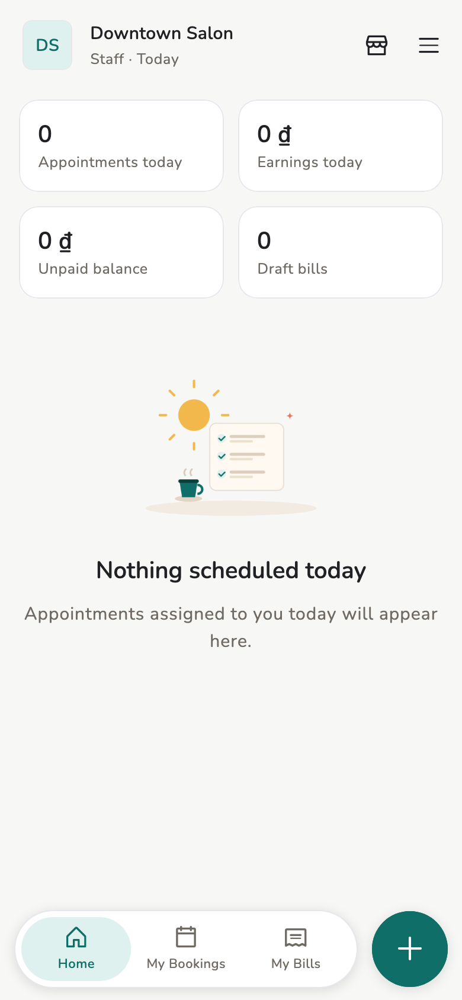

# Roles

Three roles **per store**. One device can be Owner in store A and Staff in
store B.

## Overview

In-app labels: **Owner**, **Manager**, **Staff**.

<figure class="shot-phone" markdown>
{ loading=lazy }
<figcaption>Owner / Manager</figcaption>
</figure>

<figure class="shot-phone" markdown>
{ loading=lazy }
<figcaption>Staff</figcaption>
</figure>

The bottom bar changes with the role: an Owner gets **Bookings**, a Staff
device gets only **My schedule** and **My invoices**.

## Concepts

| Job | Owner | Manager | Staff |
| --- | --- | --- | --- |
| Create appointments | Yes | Yes | **No** |
| Check-in / complete / cancel | Yes | Yes | Do not run the lifecycle like a manager |
| Draft invoices | Yes | Yes | Yes |
| Approve invoices | Yes | Yes | No (not their own) |
| Invite people | Yes | Yes | No |
| Change role | Yes | No | No |
| Service catalog (create, edit, price, deactivate, CSV import) | Yes | Yes | Use the list when drafting |
| Staff bookings (own / whole store) | Yes | No | — |
| Identity / data backup | Yes | Yes | Those rows are absent |
| Earnings / reports | Whole team | Whole team | *Their own* |

## Related pages

- [Staff](../guide/staff.md)
- [Appointments](../guide/appointments.md)
- [FAQ](faq.md)
