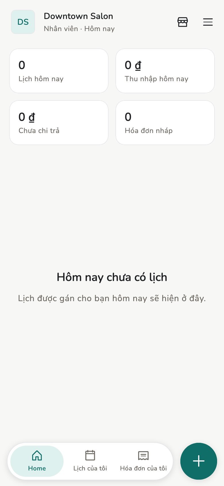

# Vai trò

Ba vai trò, tính riêng cho **từng tiệm**. Một máy có thể là Chủ tiệm ở tiệm A
mà chỉ là Nhân viên ở tiệm B.

## Tổng quan

Nhãn trong app: **Chủ tiệm**, **Quản lý**, **Nhân viên**.

<figure class="shot-phone" markdown>
{ loading=lazy }
<figcaption>Chủ tiệm / Quản lý</figcaption>
</figure>

<figure class="shot-phone" markdown>
{ loading=lazy }
<figcaption>Nhân viên</figcaption>
</figure>

Thanh dưới đổi theo vai trò: Chủ tiệm có **Đặt lịch**, Nhân viên chỉ có
**Lịch của tôi** và **Hóa đơn của tôi**.

## Khái niệm

| Việc | Chủ tiệm | Quản lý | Nhân viên |
| --- | --- | --- | --- |
| Đặt lịch hẹn | Có | Có | **Không** |
| Check-in / hoàn tất / hủy | Có | Có | Chỉ trên lịch họ được xem |
| Lập hóa đơn nháp | Có | Có | Có |
| Duyệt hóa đơn | Có | Có | Không, kể cả hóa đơn của chính mình |
| Mời người | Có | Có | Không |
| Đổi vai trò | Có | Không | Không |
| Danh mục dịch vụ (tạo, sửa, đổi giá, ngưng, nhập CSV) | Có | Có | Chỉ chọn từ danh sách khi lập nháp |
| Lịch nhân viên (chỉ họ / cả tiệm) | Có | Không | — |
| Sao lưu identity / dữ liệu | Có | Có | Máy họ không có mục này |
| Thu nhập / báo cáo | Cả đội | Cả đội | *Của mình* |

## Trang liên quan

- [Nhân viên](../guide/staff.md)
- [Lịch hẹn](../guide/appointments.md)
- [FAQ](faq.md)
