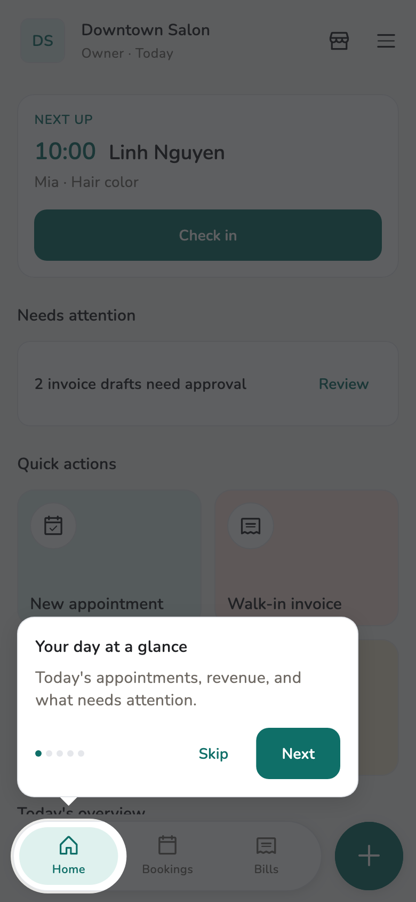
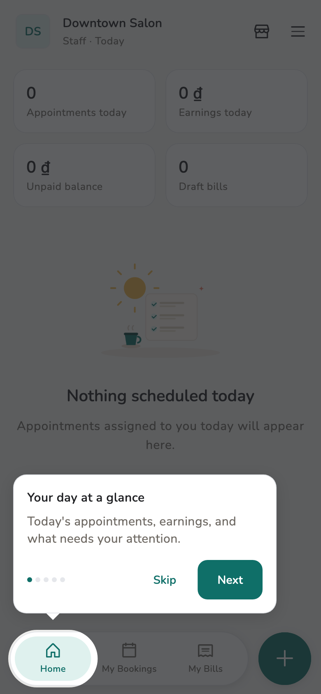

# First day

Three things to do before real customers walk in, plus the tour that labels
the controls.

## Overview

The tour runs the first time you enter a workspace. Skip does not change
data. Replay: **Settings → Replay guided tour**.

## Usage

### Tour

=== "Owner / Manager"

    The tour labels **Your day at a glance**, **Bookings**, **Bills**,
    **Add quickly**.

=== "Staff"

    The tour labels **My Bookings**, **My Bills**. Their Add step is
    **Start a new bill** — not a booking.

<figure class="shot-phone" markdown>
{ loading=lazy }
<figcaption>Owner / Manager</figcaption>
</figure>

<figure class="shot-phone" markdown>
{ loading=lazy }
<figcaption>Staff</figcaption>
</figure>

### Do this on day one

1. Write down the [recovery phrase](../admin/backup.md).
2. Export a [data backup](../admin/backup.md) once you have customers or
   bills.
3. Add [staff](../guide/staff.md) and [services](../guide/services.md)
   before booking.

!!! warning "Staff cannot create appointments"

    Only Owner and Manager book. Staff draft invoices, register availability,
    and view their own earnings. See [Roles](../reference/roles.md).

## Related pages

- [Run the day](../guide/run-the-day.md)
- [Backup and recovery](../admin/backup.md)
