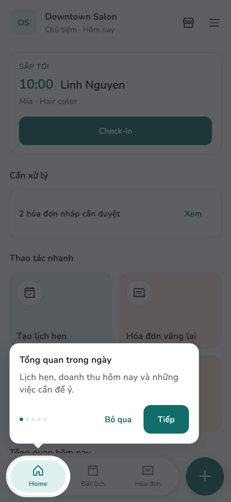
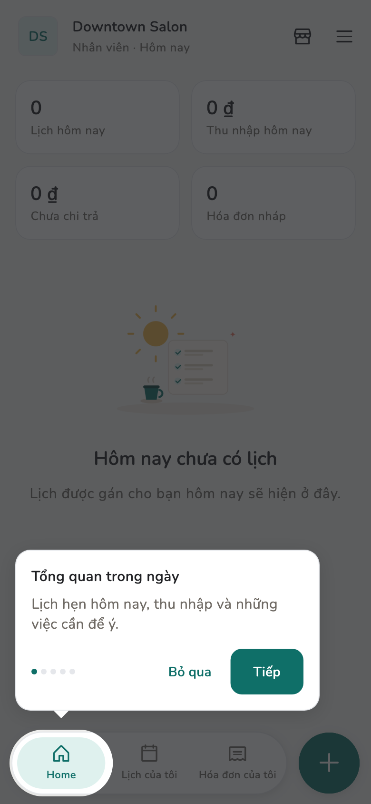

# Ngày đầu

Làm ba việc này trước khi nhận khách thật. App cũng có tour chỉ chỗ bấm.

## Tổng quan

Tour chạy lần đầu khi vào tiệm. Bỏ qua không làm thay đổi dữ liệu. Xem lại:
**Cài đặt → Xem lại hướng dẫn**.

## Cách làm

### Tour

=== "Chủ tiệm / Quản lý"

    Tour gắn nhãn **Tổng quan trong ngày**, **Lịch hẹn**, **Hóa đơn**,
    **Tạo nhanh**.

=== "Nhân viên"

    Tour gắn nhãn **Lịch của tôi**, **Hóa đơn của tôi**. Bước Tạo của họ là
    **Tạo hóa đơn mới**, không phải đặt lịch.

<figure class="shot-phone" markdown>
{ loading=lazy }
<figcaption>Chủ tiệm / Quản lý</figcaption>
</figure>

<figure class="shot-phone" markdown>
{ loading=lazy }
<figcaption>Nhân viên</figcaption>
</figure>

### Nên làm ngay

1. Ghi [24 từ khôi phục](../admin/backup.md) ra giấy.
2. Xuất [sao lưu dữ liệu](../admin/backup.md) nếu đã có khách hoặc hóa đơn.
3. Thêm [nhân viên](../guide/staff.md) và [dịch vụ](../guide/services.md)
   trước khi đặt lịch.

!!! warning "Nhân viên không đặt được lịch hẹn"

    Chỉ Chủ tiệm và Quản lý đặt lịch. Nhân viên lập hóa đơn nháp, đăng ký giờ
    rảnh, xem thu nhập của mình. Xem [Vai trò](../reference/roles.md).

## Trang liên quan

- [Một ngày làm việc](../guide/run-the-day.md)
- [Sao lưu và khôi phục](../admin/backup.md)
