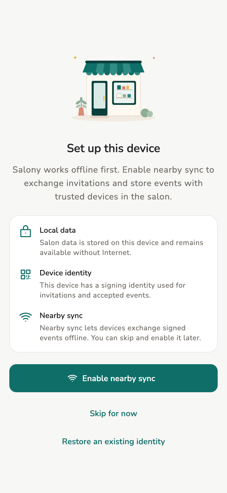
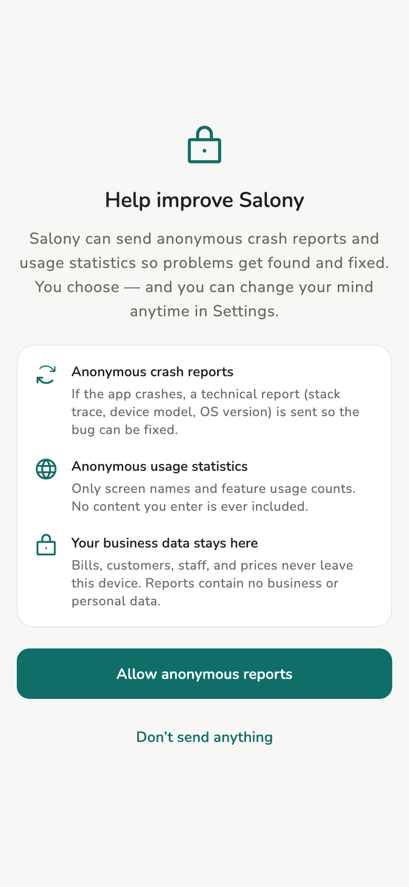

# First launch

Create an identity on this device — no login account is required.

## Overview

The welcome flow has three steps: language, crash reports, then identity.
Language and crash reports can be changed later in **Settings**.

<figure class="shot-phone" markdown>
{ loading=lazy }
<figcaption>First-run setup</figcaption>
</figure>

<figure class="shot-phone" markdown>
{ loading=lazy }
<figcaption>Crash & usage reports</figcaption>
</figure>

## Prerequisites

Install a trial build from [Downloads](../admin/downloads.md), or use a copy
you already have.

## Usage

1. Pick this device’s language (later: **Settings → Language**).
2. Answer **Crash & usage reports** — allow or send nothing.
3. **Create an identity on this device**, or **Restore an existing identity**
   (24 words / file / receive from another device).

!!! warning "There is no login account to recover"

    Identity is a [keypair](../reference/terminology.md#keypair) on the
    device, not an account. Lose the 24 words, the identity file, and every
    paired device, and that identity is gone. See [Backup](../admin/backup.md).

## Related pages

- [Create or join a store](store.md)
- [Identity](../tech/identity.md)
- [FAQ](../reference/faq.md)
