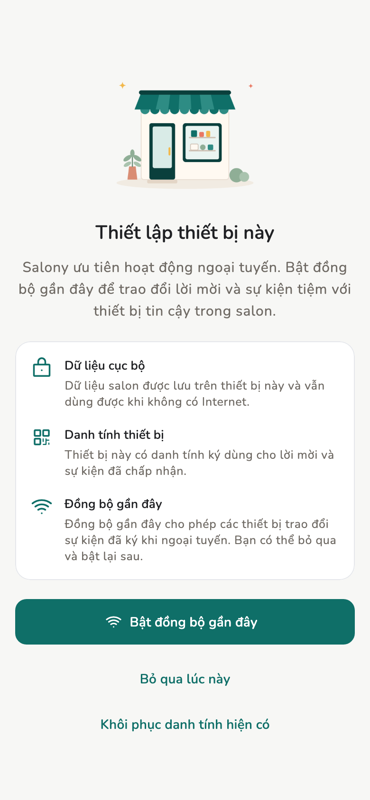
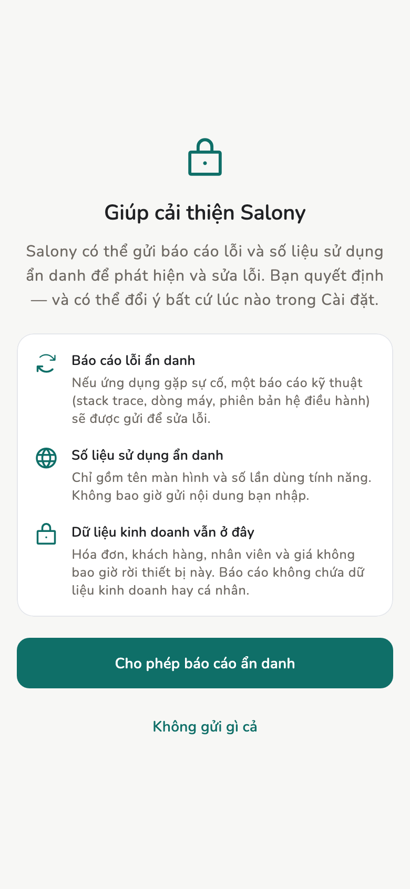

# Lần đầu mở app

Tạo **identity** ngay trên máy này. Không cần email, không cần mật khẩu.

## Tổng quan

Ba bước lúc mở lần đầu: chọn ngôn ngữ, chọn có gửi báo cáo lỗi không, rồi
tạo identity. Sau này đổi ngôn ngữ và báo cáo lỗi trong **Cài đặt**.

<figure class="shot-phone" markdown>
{ loading=lazy }
<figcaption>Thiết lập lần đầu</figcaption>
</figure>

<figure class="shot-phone" markdown>
{ loading=lazy }
<figcaption>Báo cáo lỗi & sử dụng</figcaption>
</figure>

## Điều kiện

Cài bản thử từ [Tải về](../admin/downloads.md), hoặc bản bạn đã có trên máy.

## Cách làm

1. Chọn ngôn ngữ (sau này: **Cài đặt → Ngôn ngữ**).
2. **Báo cáo lỗi & sử dụng** — đồng ý hoặc không gửi gì.
3. **Tạo identity trên máy này**, hoặc **Khôi phục danh tính hiện có**
   (24 từ / tệp / nhận từ máy khác).

!!! warning "Không có nút quên mật khẩu"

    Identity là [keypair](../reference/terminology.md#keypair) trên máy, không
    phải tài khoản. Mất 24 từ, tệp identity, và mọi máy đã ghép thì không lấy
    lại được. Xem [Sao lưu](../admin/backup.md).

## Trang liên quan

- [Tạo hoặc vào tiệm](store.md)
- [Identity](../tech/identity.md)
- [FAQ](../reference/faq.md)
