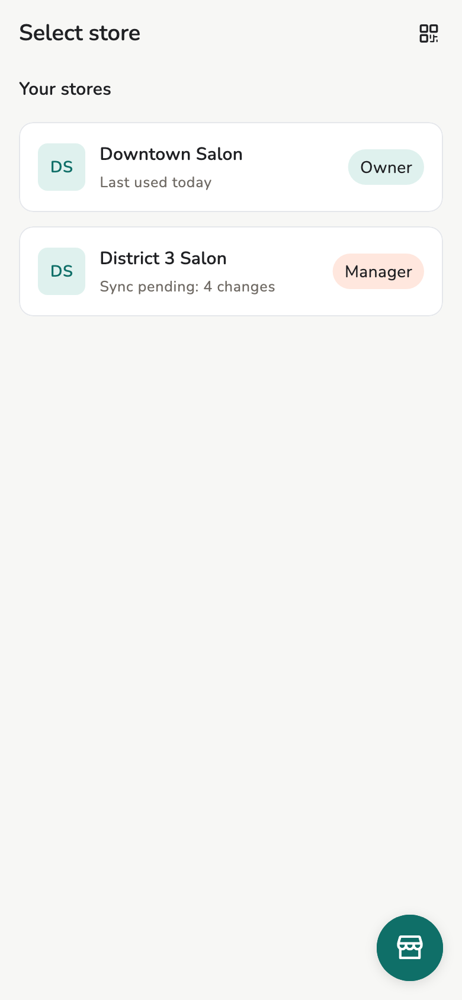
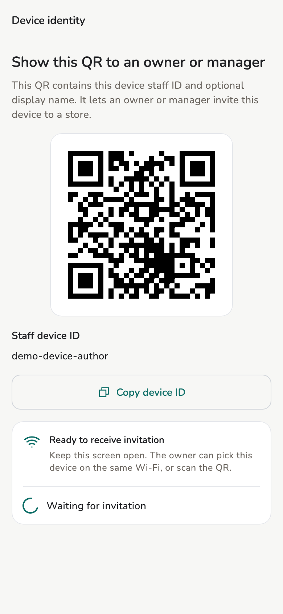

# Create or join a store

This device becomes a member of a store — the role is **per store**.

## Overview

Two paths: **Create store** (this device is Owner), or join an existing store
by invitation / add-device.

<figure class="shot-phone" markdown>
{ loading=lazy }
<figcaption>Select store</figcaption>
</figure>

## Usage

=== "Create a store"

    On **Select store**: **Create store**. Name, currency, optional logo. This
    device becomes **Owner**.

    One person can belong to several stores; the role is not shared across
    stores.

=== "Join an existing store"

    1. New device: **Settings → Device identity** (or Welcome). Keep that
       screen open.
    2. Owner/manager: **Staff → Add staff → Invite staff**. Under
       **Nearby devices**, tap the name, confirm the six-digit code on
       both screens, pick a role, send. If it is not listed, **Scan QR**.
    3. New device **Accept invitation**.

    Or **Add another device** on the owner device — iPad / second phone,
    invited as **Manager** by default. See [Devices and sync](../admin/devices.md).

<figure class="shot-phone" markdown>
{ loading=lazy }
<figcaption>The new device shows this QR</figcaption>
</figure>

## Related pages

- [First day](first-day.md)
- [Staff](../guide/staff.md)
- [Roles](../reference/roles.md)
