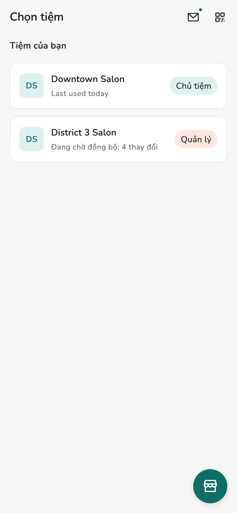
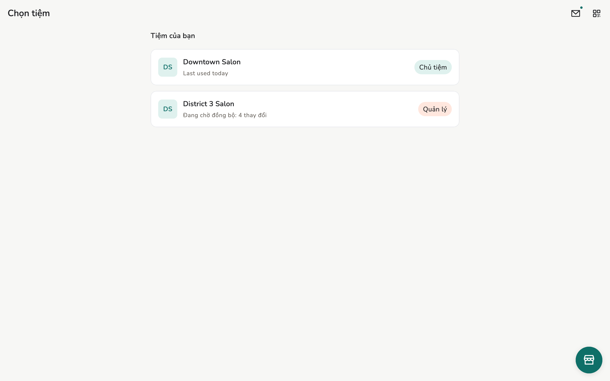
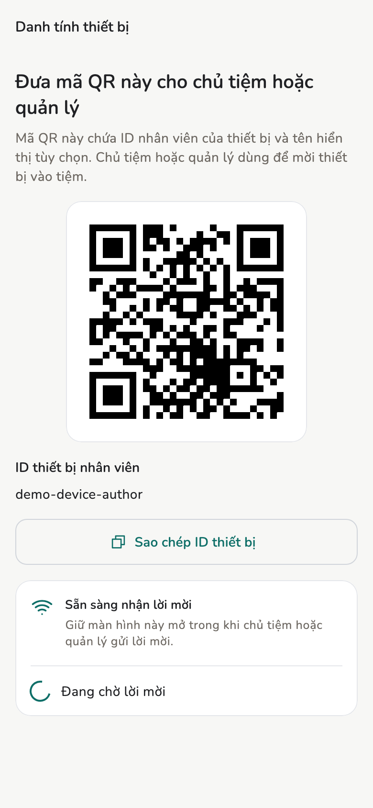

# Tạo hoặc vào tiệm

Máy này tham gia một tiệm. Vai trò bạn nhận chỉ có giá trị **trong tiệm đó**.

## Tổng quan

Hai cách: **Tạo tiệm** (máy này là Chủ tiệm), hoặc vào tiệm có sẵn khi được
mời / thêm thiết bị.

<figure class="shot-phone" markdown>
{ loading=lazy }
<figcaption>Điện thoại</figcaption>
</figure>

<figure class="shot-wide" markdown>
{ loading=lazy }
<figcaption>Máy tính bảng và máy tính bàn</figcaption>
</figure>

## Cách làm

=== "Tạo tiệm"

    Trên **Chọn tiệm**, bấm **Tạo tiệm**. Đặt tên, tiền tệ, logo nếu muốn. Máy
    này thành **Chủ tiệm**.

    Một người có thể mở nhiều tiệm. Vai trò ở tiệm này không mang sang tiệm kia.

=== "Vào tiệm có sẵn"

    1. Trên máy mới: **Cài đặt → Danh tính thiết bị** (hoặc màn chào) để hiện
       mã QR.
    2. Trên máy của Chủ tiệm hoặc Quản lý: **Nhân viên → Mời**, quét mã QR đó,
       chọn vai trò rồi gửi.
    3. Máy mới bấm **Nhận lời mời**.

    Muốn thêm máy thứ hai cho chính mình (iPad chẳng hạn) thì trên máy của Chủ
    tiệm chọn **Thêm thiết bị khác**; máy đó mặc định là **Quản lý**. Chi tiết:
    [Thiết bị và đồng bộ](../admin/devices.md).

<figure class="shot-phone" markdown>
{ loading=lazy }
<figcaption>Máy mới hiện mã QR này</figcaption>
</figure>

## Trang liên quan

- [Ngày đầu](first-day.md)
- [Nhân viên](../guide/staff.md)
- [Vai trò](../reference/roles.md)
