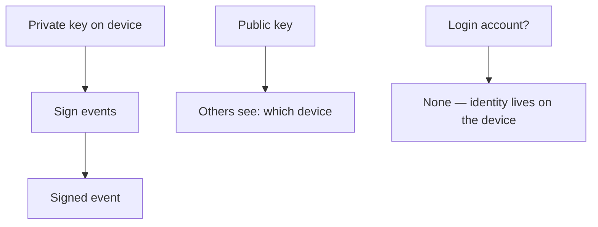

# Identity

You do not have a Salony account. Identity is an
[Ed25519](../reference/terminology.md#ed25519)
[keypair](../reference/terminology.md#keypair) on this device.

## Overview

The private key does not leave the device unless *you* export a backup or
transfer to a new device.

<figure markdown>
{ loading=lazy }
<figcaption>Settings → Device identity</figcaption>
</figure>

## Technical details

- Welcome does not ask for a login account.
- Each device has its **own** identity. Adding a device pairs a new machine;
  it is not “log into the same account”.
- The signature on an event proves *which device* wrote it.
- The 24 words / encrypted identity file are the salon keys.

## Limitations

No login account means there is nothing to “recover a password” against.
Lose the 24 words **and** the identity file **and** every paired device, and
that identity is gone. Salony does not keep a copy of the private key.

## Related pages

- [Backup and recovery](../admin/backup.md)
- [First launch](../start/first-launch.md)
- [Terminology](../reference/terminology.md)
