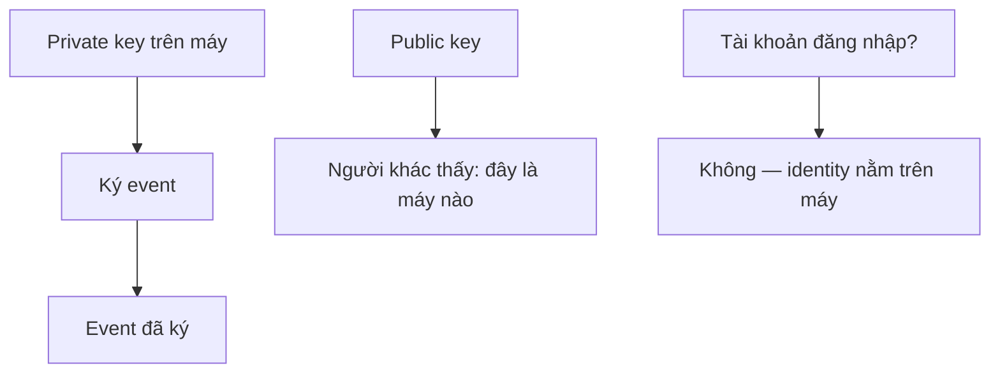

# Identity

Salony không có tài khoản đăng nhập. **Identity** là
[keypair](../reference/terminology.md#keypair)
[Ed25519](../reference/terminology.md#ed25519) nằm trên đúng máy này.

## Tổng quan

Khoá riêng không rời máy, trừ khi *bạn* xuất sao lưu hoặc chuyển sang máy mới.

<figure markdown>
{ loading=lazy }
<figcaption>Cài đặt → Danh tính thiết bị</figcaption>
</figure>

## Chi tiết kỹ thuật

- Màn chào không hỏi tài khoản đăng nhập.
- Mỗi thiết bị có identity **riêng**. Thêm máy là ghép máy mới, không “đăng
  nhập cùng tài khoản”.
- Chữ ký trên event cho biết *máy nào* đã viết.
- 24 từ / tệp identity đã mã hoá là chìa khoá tiệm.

## Giới hạn

Không có tài khoản thì không có chỗ “lấy lại mật khẩu”. Mất 24 từ **và** tệp
identity **và** mọi máy đã ghép thì identity đó hết. Salony không giữ bản sao
khoá riêng.

## Trang liên quan

- [Sao lưu và khôi phục](../admin/backup.md)
- [Lần đầu mở app](../start/first-launch.md)
- [Thuật ngữ](../reference/terminology.md)
