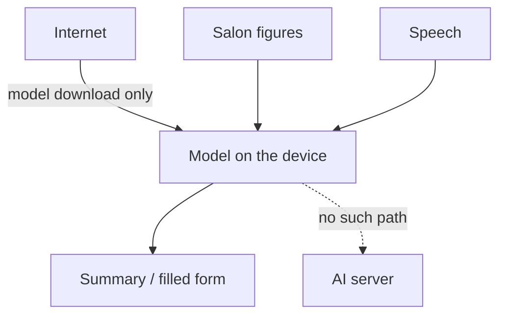
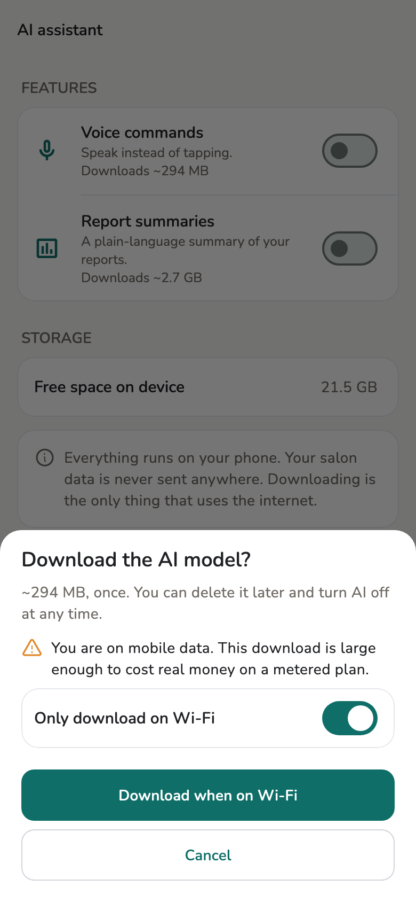

# AI that runs on the device

Report summaries and voice fill run **on your own device**. No step sends
speech or salon figures to a server.

## Overview

The model downloads once and then stays on the device. After that it works with
the network unplugged. The internet is needed only to **fetch the model**.

<figure class="shot-phone" markdown>
{ loading=lazy }
<figcaption>The one download</figcaption>
</figure>

## Technical detail

- Two runtimes, one job each: **`flutter_gemma`** (LiteRT / MediaPipe) for
  text, **`sherpa_onnx`** (ONNX Runtime) for speech.
- Vietnamese recognition uses **PhoWhisper**, a model built for Vietnamese with
  published WER figures — not a multilingual model pressed into service.
- The common shortcut is to call the operating system's speech service. Salony
  **declines** it: that path cannot guarantee offline operation, which means
  salon speech could leave the device.
- On a device without the memory, the app says **This device cannot run it**
  rather than quietly falling back to a server.
- Deleting the model reclaims the space. Turning the feature back on downloads
  it again.

## Limits

Running on the device means **a weak device has no such feature**, and a
summary can take about a minute. That is the price of not shipping the data
anywhere.

## Related pages

- [AI assistant](../guide/ai-assistant.md)
- [Local-first](local-first.md)
- [Limits](limits.md)
