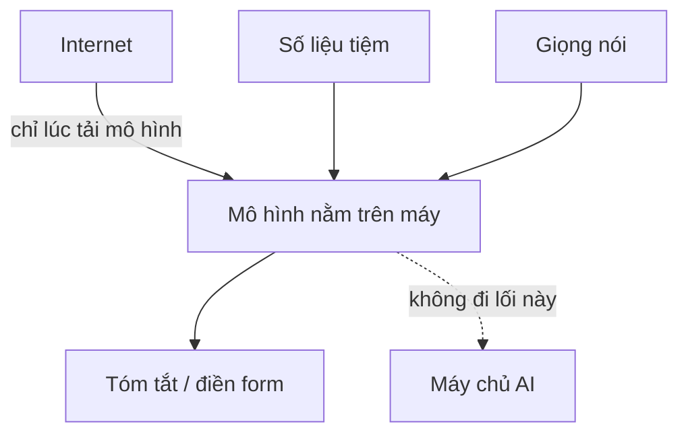
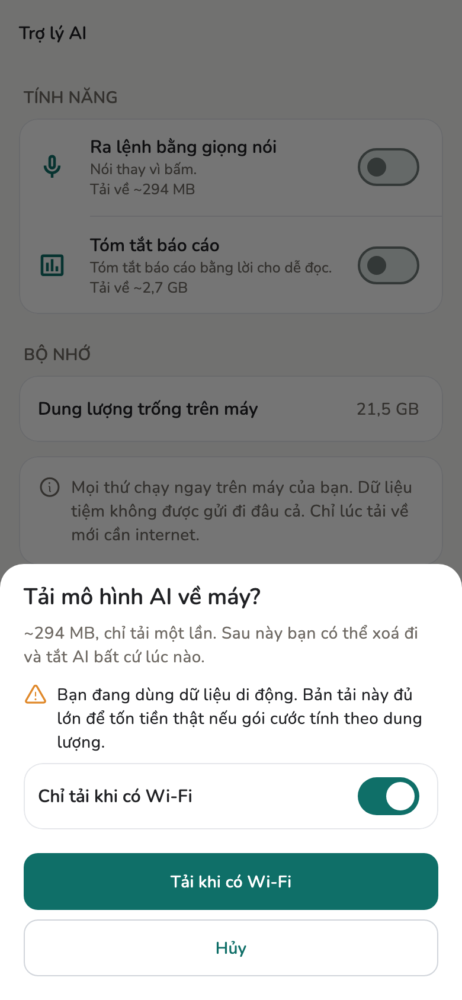

# AI chạy trên máy

Tóm tắt báo cáo và ra lệnh bằng giọng nói chạy **trên chính máy bạn**. Không
có bước nào gửi tiếng nói hay số liệu tiệm lên máy chủ.

## Tổng quan

Mô hình được tải về một lần rồi nằm luôn trên máy. Sau đó rút mạng vẫn dùng
được. Internet chỉ cần đúng lúc **tải mô hình**.

<figure class="shot-phone" markdown>
{ loading=lazy }
<figcaption>Lần tải duy nhất</figcaption>
</figure>

## Chi tiết kỹ thuật

- Hai runtime, mỗi cái một việc: **`flutter_gemma`** (LiteRT / MediaPipe) lo
  phần chữ, **`sherpa_onnx`** (ONNX Runtime) lo phần tiếng nói.
- Nhận dạng tiếng Việt dùng **PhoWhisper** — mô hình làm riêng cho tiếng
  Việt, có số đo WER công bố, không phải mô hình đa ngữ dùng tạm.
- Lựa chọn phổ biến hơn là gọi dịch vụ nhận dạng giọng nói của hệ điều hành.
  Salony **không** chọn, vì đường đó không bảo đảm chạy ngoại tuyến — nghĩa
  là tiếng nói trong tiệm có thể ra khỏi máy.
- Máy không đủ bộ nhớ thì app ghi rõ **Máy này không dùng được** thay vì âm
  thầm chuyển sang gọi máy chủ.
- Xoá mô hình là lấy lại dung lượng. Bật lại thì tải lần nữa.

## Giới hạn

Chạy trên máy nghĩa là **máy yếu thì không có tính năng này**, và tóm tắt có
thể mất khoảng một phút. Đây là cái giá của việc không gửi dữ liệu đi.

## Trang liên quan

- [Trợ lý AI](../guide/ai-assistant.md)
- [Local-first](local-first.md)
- [Giới hạn](limits.md)
